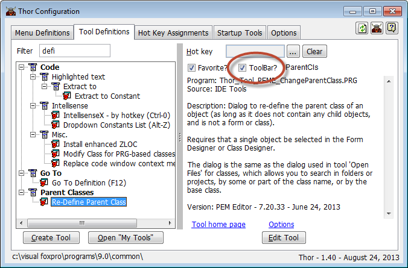
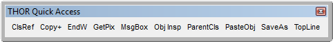

# Thor Change Log

### Thor 1.47.02 - Released 2024-01-13
* Removed call to Thor News as part of CFU (Issue #249)
* Removed use of `Thor_Proc_MessageBox.PRG` as it had problems with positioning under some conditions (Issue #249)
* Changed order of "Never Update" items in CFU (Issue #251)
* Renamed two _Screen properties in wild guess attempt to fix error reported in issue #246.
* Fixed bug when selecting "toolbar" checkbox in Thor Launcher the second time (Issue #252)

### Thor 1.47.01 - Released 2024-01-05
* Fixed bug when opening Thor Configuration screen.

### Thor 1.47 - Released 2024-01-04
* In the CFU screen, hide 'Normal' updates if there is a "My Updates" file with the same AppID property (Issues #203, #230)
* Updated version information is no longer read for projects marked "Never Update" (Issue #224)
* Restore projects after CFU (Issue #96)
* Thor updates itself even when run first time from old version of Thor.App instead of using current version (Issues #227, #212)
* Thor Tools menu indicates if tool 'IntellisenseX By Dot' is active. (Issue #242)
* Fixed bug when recording last date CFU run. It had been only doing so if called from RunThor.  (Issue #220)
* Removed use of `_Screen.oThorEngine`, which held some Thor tables open. (Issue #241)
* New Project FoxGet
* Modified Updater to GoFish to register with Thor without calling GoFish.APP

### Thor 1.46.17 - Released 2023-12-16
* Bug in RunThor fixed (#219)
* Added missing icon file (#235)
* Remove references to Sys(3054) - (Issue #210)
* Minor change to order of items in Contributing.md (Issue #229)
* Clicking on column headers in CFU works for all relevant columns, resets to default for others.

### Thor 1.46.16 - Released 2023-12-05
* Corrections to Thor installation page (Issue 226)
* Modifications to CFU
    * fixed bug where clicking on "Installed Version" column opened link to the application home page.  (Issues 214, 215)
    * show current Thor version and date at bottom right of form
    * new checkbox 'Hide "Never Update" projects'
* Modified handling of the menu items under "Thor" in system menu pad

### Thor 1.46.15 - Released 2023-11-27
* Applied Lutz's upgrade to extracting zip files by using PowerShell if the primary attempt (using Shell.Application) fails
* Moved splitter files back to Tools\Procs (moved in error some months ago)
* Created new plug-ins to run before and after CFU so that user can preserve their environment (such as open projects)

### Thor 1.46.14 - Released 2023-11-26
* Removed reference to now-defunct Thor forum when installing Thor
* Add "Dynamic Forms" to list of projects required for download when installing Thor
* Moved version files downloaded during CFU into a separate sub-folder
* Moved 'CheckForUpdates.SCX' to the Procs folder

### Thor 1.46.13 - Released 2023-11-15
* Fix recently introduced bug in "RunThor".  (When called with # days as a parameter, it would update Thor but not bring up the CFU screen for other projects.)

### Thor 1.46.12 - Released 2023-11-11
* Fix bug in "Hot Key Assignments" page (tools without extensions)
* Fix possible infinite loop (handling project dependencies)
* Preserve state of "Thor updates" grid as CSV in CFU sub-folder

### Thor 1.46.11 - Released 2023-10-30
* New tool under "Thor" menu: "What's New (Thor Change Log)"
* Begin use of "Thor_Proc_MessageBox", alternative to MessageBox

### Thor 1.46.10 - Released 2023-10-28
* New table "VFPHotKeys" with list of all VFP shortcut keys:
    * User warned about possible conflicts when assigning hot keys
    * Page "Hot Key Assignments" in Thor Configuration form has new column showing possible conflicts
* Remove HotKeyDefinitions, erroneously added in 1.46.08
* New optional font size for Thor menus 
* New tool "Force Thor Update"

### Thor 1.46.09 - Released 2023-10-22
Fixes:
* If update of Thor itself failed, Thor.App had been deleted, leaving user dead in water
* Manage plug-ins referenced deprecated prg
* Second attempt to fix mangled table HotKeyDefinitions

### Thor 1.46.08 - Released 2023-10-20
* Fix mangled table HotKeyDefinitions

### Thor 1.46.07 - Released 2023-10-13
* Modify 'Hidden Context Menu" to use Ctrl+Click to go directly to Help

### Thor 1.46.06 - Released 2023-09-29
* New Thor tool: "Tool Manager"

### Thor 1.46.05 - Released 2023-09-28
* Fix bug, remove _Screen._ThorClearAllObject

### Thor 1.46.04 - Released 2023-09-28
* Attempt to fix obscure bug in Check For Updates (PEM Editor install fails under some conditions)
* Fix in registering tool with Thor (when tool called with an object based on empty class)

### Thor 1.46.03 - Released 2023-08-29
* Removed updaters for two projects, SFRegExp and Bin2Text
* Thor.App not changed, so no version change

### Thor 1.46.03 - Released 2023-08-26

* Fixed bug in accessing Tables folder from Thor menu pad => Folders
* Change caption for "Edit Tool" in principal Thor forms to read "Documentation and Settings"

### Thor 1.46.02 - Released 2023-08-19

* Fix bug where some items (GoFish and possibly others) not appearing under "Thor Tools" menu pad.

### Thor 1.46.01 - Released 2023-08-19

* Add new property .AppID to all tools to identify the project they originate in.
* Fix bug where invalid URLs at github were not recognized as "file not found"
* Enhanced error reporting for problems encountered in a version file
* Enhancements to CFU EventLog.txt to display URLs downloaded and the destination file.
* New menu item under Thor=>Folders for most recent CFU (Check For Updates) logs

### Thor 1.46 - Released 2023-08-11

* Added new property .AppID for Thor tools so that they can identify the VFPX Project they originate in.

### Thor 1.45.28 - Released 2023-08-06

* Add new tool "Browse Hot Keys" to Thor menu pad
* For CFU, clean up event logging and create new folder in Sys(2023)

### Thor 1.45.27 - Released 2023-07-22

* Extensive refactoring to ease the issue of releasing modifications to core programs for CFU
* Re-arrangement of "Thor" menu items
* New property "Dependencies" in Updater/Version file where one project requires another.
* New pop-up menu for help and other features when pressing Ctrl when selecting a menu item from a Thor menu

### Thor 1.45.26 - Released 2023-06-21

Enhanced error reporting for errors during downloading and installing projects in "Check For Updates".

### Thor 1.45.25 - Released 2023-06-11

Revert code that re-opened projects after CFU; caused failure "too many dos"

### Thor 1.45.24 - Released 2023-06-10

Tweaks to Property used in _Screen

### Thor 1.45.21 - Released 2023-05-20

Favorites now appear in bold for menu items from the system menu or popup menus

### Thor 1.45.19 - Released 2023-04-08

* Two bug fixes
* Add 'Project Type" column to CFU form

### Thor 1.45.17 - Released 2023-04-06

* Modified menu options in system menu pad for Thor, adding "Project Home Pages"
* Changed handling of Thor News to use new location in https://github.com/VFPX/ThorNews

### Thor 1.45.16 - Released 2023-04-02

Enable sorting on most of columns in CFU form.

### Thor 1.45.15 - Released 2023-04-02

Fix to issue where CFU form position not handled properly in multiple monitor situation

### Thor 1.45.14 - Released 2023-03-24

Bug fix in 1.45.11&12&13

### Thor 1.45.11 - Released 2023-03-23

References to installed Thor tools using explicit full paths are replaced with uses of _Screen.cThorFolder so that that are relocatable

### Thor 1.45.10 - Released 2023-03-21

Fix to problem where Check For Updates screen does not come up in visible screen

### Thor 1.45.09 - Released 2023-03-19

Fix bad links in Framework

### Thor 1.45.07 - Released 2023-01-20

Separated version number and date into distinct columns into CFU grid.

### Thor 1.45.06 - Released 2023-01-20

Re-arrangement of options in the Thor menu pad in system menu, including hot key assignments.

### Thor 1.45.05 - Released 2023-01-13

New Updater property to indicate that a project is to be installed in the Tools folder instead of a sub-folder of Tools\Apps or Tools\Components.

### Thor 1.45.04 - Released 2023-01-06

Changes to Thor menu pad in VFP system menu
* Remove outdated/irrelevant menu items
* Correct links to Forums
* For "Thor Framework", ignore errors for file not found (bad links, essentially)
* Correct links to Change Logs

### Thor 1.45.03 - Released 2022-12-26

Thor News back in business.

### Thor 1.45.01 - Released 2022-12-13

Added ability to move or delete separator lines in menus in Thor Configuration form.

### Thor 1.45 - Released 2022-03-05

Updated the Check for Updates process to log unzipping failure.

### Thor 1.44 - Released 2022-03-04

Updated the Check for Updates process to use Shell.Application instead of VFPCompression to unzip files.

### Thor 1.43 - Released 2021-12-28

Updated the Check for Updates process to look at the GitHub repository of each project rather than VFPXRepository.com.

### Thor 1.40 – Released 2013-08-26

Added the Thor ToolBar.  Tools may be added to the Toolbar may using the checkbox shown in the Thor Configuration form,  below (and also available in the [Tool Launcher](Docs/Thor_launcher.md).)

When you add a tool to the Thor Toolbar, you can select a caption for the tool or select an image to represent it.  In the sample below, abbreviated captions are used.

The toolbar’s size, positioning, and docking, persist from one session to the next. (Truth be told, persisting the docking has been problematic.)

### Thor 1.30 – Released 2012-08-19

*   Added [Tool Launcher](Docs/Thor_launcher.md), available from the Thor menu in the VFP system menu

*   Added [Thor IntellisenseX](https://github.com/VFPX/IntelliSenseX).

### Thor 1.1 - Released 2011-10-23  

Thor Production Release - Released 2011-09-03  

### Thor I Beta 6 - Released 2011-08-22 (88 downloads)

*   a few minor bug fixes

### Thor I Beta 5 - Released 2011-08-09 (91 downloads)

*   Miscellaneous minor adjustments and a couple of bug fixes

### Thor I Beta 4 - Released 2011-07-17 (125 downloads)

*   Re-installation now occurs automatically. Simply using the new version of Thor.App will cause re-installation.
*   Includes full online documentation.

### Thor I Beta 3 - Released 2011-07-06 (94 downloads)  

### Thor I Beta 2 - Released 2011-07-04 (61 downloads)  

### Thor I Beta - Released 2011-06-03 (237 downloads)

## Acknowledgments

*   The concept for this project started with Jim Nelson (the Project Manager).
*   The design was created by a group which included Doug Hennig, Eric Selje, and Tore Bleken.
*   The entire UI was designed and implemented by Doug Hennig.

----
## Contribution
See [contribution](./.github/CONTRIBUTING.md)

Last changed: _2023/01/20_ 