## User Tables

**Table** |**Description**
---|---
[Thor](#thor)|Options values (Thor Configuration / Options page)
[MenuDefinitions](#menudefinitions)|Definition of menus -- each menu in the system menu pad, popup menus, and sub-menus
[MenuTools](#menutools)|Child records of MenuDefinitions -- tools, sub-menus, and separators.
[HotKeyDefinitions](#hotkeydefinitions)|Table of definitions for all hot keys used in MenuDefinitions.HotKeyID or ToolHotKeyAssignments.HotKeyID. 
[ToolHotKeyAssignments *](#toolhotkeyassignments)|Mapping of tools to their hot key assignments in HotKeyDefinitions
[ToolBarTools *](#toolbartools)|Indicates which tools show up in the ToolBar
[Favorites *](#favorites)|Indicates which tools are Favorites
[StartupTools *](#startuptools)|Indicates which tools are to be run when Thor starts.
[TableAliases](#tablealiases)|Table Aliases used by tools "IntellisenseX" and "GoToDefinition".  
LastCheckForUpdatesDate|Last date "Check For Updates" was run automatically by the call to RunThor; the parameter to RunThor indicates how frequently "CFU" runs automatically.
LogFile|No longer used
Thor_LogFile|No longer used 

    * Note that these four tables could well have been designed as a single table (they all have the same primary key) 
      if they had all come into existence at the same time.
    
## System Tables (Constant)

**Table** |**Description**
---|---
[HotKeys](#hotkeys)|Table used to convert a keypress into internal representation.
[VFPHotKeys](#vfphotkeys)|All VFP hotkeys (shortcuts). Used to warn users when a selected hotkey combination conflicts with its use within VFP.

### Thor

One record for every Options setting (see Thor Configuration / Options page).  

Fields "Tool" and "Key" are used in combination to read and write values:

    * get an option
    lxValue = ExecScript(_Screen.cThorDispatcher, "Get Option=", lcKey, lcTool)
    * set an option
    ExecScript(_Screen.cThorDispatcher, "Set Option=", lcKey, lcTool, xValue)

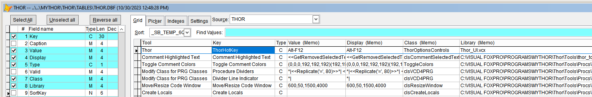

**Field** |**Description**
---|---
Tool|Name of the tool this option belongs to. Not the same as either the stem name of the tool or its prompt.
Key|Name of the key relative to the tool this option belongs to
Type|Data type: C/L/N/D (D is stored as # days since 1899-12-30)
Value|Transform of value, dependent on data type
Display|Display form of value (unclear if this is still used)
Library|Class library for the container used in the Thor Configurations / Options page for setting this option.
Class|Name of the class for the container used in the Thor Configurations / Options page for setting this option.
Caption|(unclear if this is still used)
Valid|No Longer Used
Sortkey|No Longer Used

### MenuDefinitions

Definition of menus -- each menu in the system menu pad, popup menus, and sub-menus.

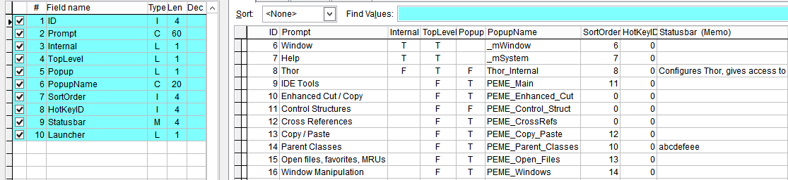

**Field** |**Description**
---|---
Prompt | Caption used for this menu
Internal | Indicates a menu that is a VFP-defined menu (in the VFP system menu).
TopLevel | Indicates a custom menu that appears in the VFP system menu.
PopUp | Indicates a custom menu that may be activated by a hot key, if assigned.
PopUpName | The name used for the menu in `Define Menu `
SortOrder | As you would expect
HotKeyID | For Popup menus, a foreign key to HotKeyDefinitions for the hotkey to activate the menu
StatusBar | Text to appear in the status bar for this menu
Launcher | No Longer Used

### MenuTools

Child records of MenuDefinitions -- tools, sub-menus, and separators.

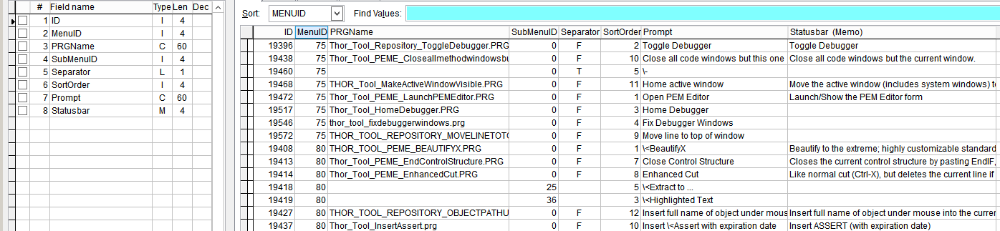

**Field** |**Description**
---|---
MenuID | Foreign key to MenuDefinitions (indicating child records)
PRGName | The file name (no path) of a Tool PRG.
SubMenu | Foreign key to MenuDefinitions indicating a sub-menu to the current record
Separator | Indicates a separator line
SortOrder | Ordering for all records for a given MenuID
Prompt | Caption for the menu item (by default, same as tool prompt, but modifiable in Thor Configuration
StatusBar | Text to appear in the status bar for this menu item.

### HotKeyDefinitions

Table of definitions for all hot keys used in MenuDefinitions.HotKeyID or ToolHotKeyAssignments.HotKeyID. 

Records are added to this table only as the user tries to assign hot keys to tools or menus, so it is not a list of all possible hot key definitions and is different for each user.

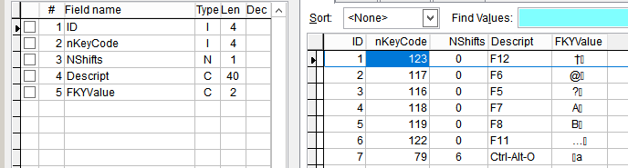

**Field** |**Description**
---|---
ID|Primary key, referenced by MenuDefinitions.HotKeyID and ToolHotKeyAssignments.HotKeyID. 
nKeyCode|KeyCode value (similar to values in KeyPress event)
nShifts|Shifts value (similar to values in KeyPress event)
Descript|Visible description of this key
FkyValue|Value used when creating a macro for this key.

### ToolHotKeyAssignments

Mapping of tools to their hot key assignments in HotKeyDefinitions

Field HotKeyID is a foreign key to HotKeyDefinitions

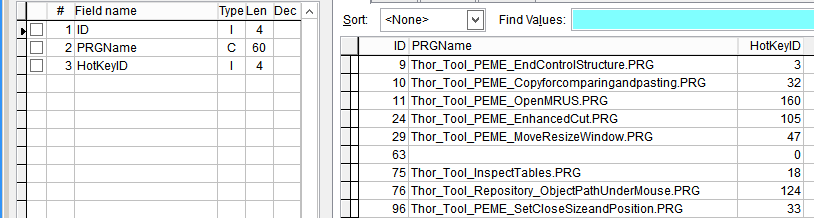

### ToolBarTools

One record for every tool that has ever been indicated as being in the toolbar.

Notes:

1. The PRGName is just the file name (no path) of a Tool PRG.
2. There is an option on Configuration Form / Options page for Thor that controls whether the ThorToolbar is docked with other FoxPro toolbars.

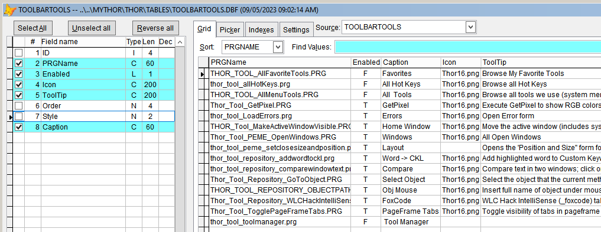

**Field** |**Description**
---|---
PrgName|The file name (no path) of a Tool PRG.
Enabled|In use?
Caption|Caption of the tool in the PRG (normally brief)
Icon|Picture (if any) used for the tool
Tooltip|Tooltip for the button when it appears in the toolbar
ID|Autoinc
Order|No longer used
Style|No longer used

### Favorites

One record for every tool that has ever been marked as a favorite. Favorites show up in two places:

1. As bold any time the tool is shown in a Thor menu.
2. On the Favorites page in Tool Launcher.

Notes:

1. The PRGName is just the file name (no path) of a Tool PRG.
2. The logical field "Startup" is poorly named and thus misleading. It indicates whether the tool is a favorite or not.

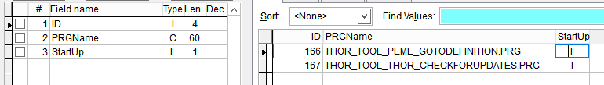

### StartupTools

One record for every tool that has ever been marked to run when Thor starts.

Note that the PRGName is just the file name (no path) of a Tool PRG.

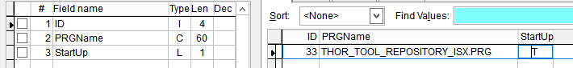

### TableAliases

One record for each "Table Alias" used by tools "IntellisenseX" and "GoToDefinition".  

See the [Alias Dictionary](https://github.com/VFPX/ThorRepository/blob/master/docs/thor_tool_repository_isxtablealiases.md).

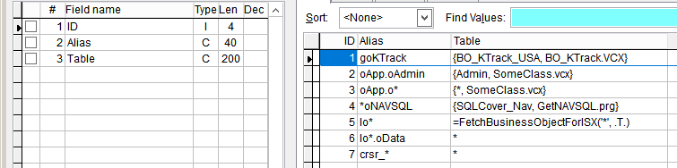

### HotKeys

Magical table that maps a value from Inkey() to an internal representation usable by Thor (KeyCode, Shifts, and FkyValue). 

Origin unknown.

See class HotKey of Thor_Utils.vcx

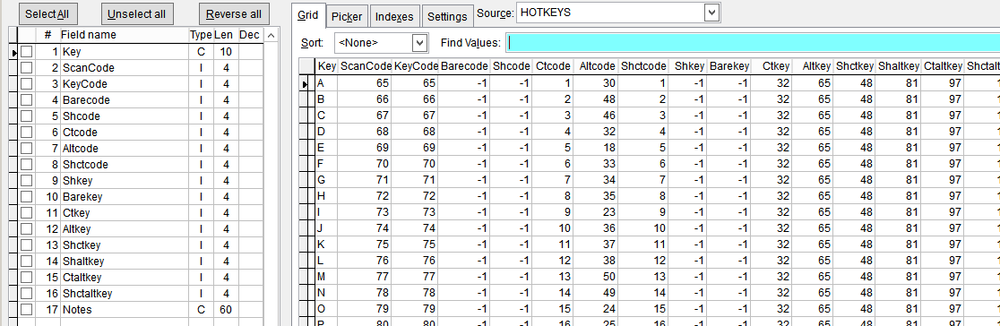

### VFPHotKeys

List of all VFP hotkeys (shortcuts), obtained from the "Keyboard Shortcuts (Visual FoxPro)" page in the Help system.

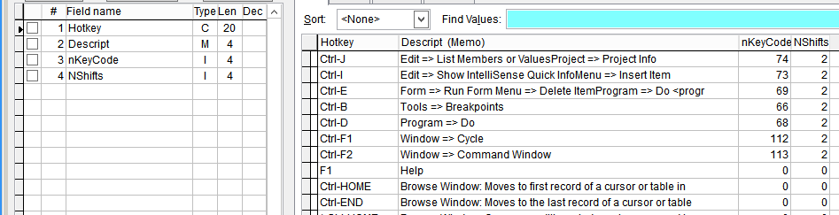