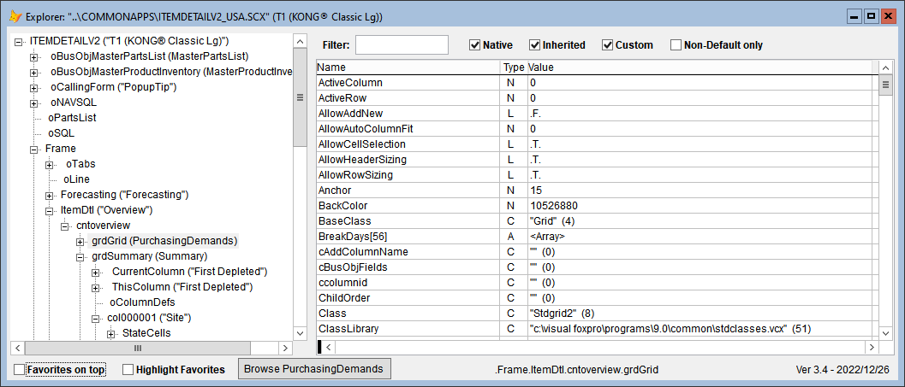

**[Object Explorer](https://github.com/VFPX/ObjectExplorer) Enhancements** 
---

### #43, 2022-12-26

[Object Explorer](https://github.com/VFPX/ObjectExplorer), one of the most recent projects added to VFPX, is a tool that allows you to explore objects, collections, and array properties in both production and in your IDE. You can invoke Object Explorer at any time by hovering over any object in a form and using a hot key, and Object Explorer will open for that object and the form it belongs to.

The Object Explorer form presents a navigable treeview on the left and the members of the selected node in the grid on the right.

The recently added new features include:

* Double-click on a row in the grid to edit the value of the property.
* Double-click on an array property to fill the grid with all the array elements, which can then be edited.
* Handling of Favorites:
    * Right-click on a row to bring up context menu where you can indicate whether that the property is a Favorite.
    * Checkboxes on the bottom indicate how Favorites are to be used.
* In the IDE, right-click on a node in the TreeView to assign that node into a public variable.  
   * You will be prompted for the name of the public variable.  
   * The name will be remembered for re-use.  
   * The public variable is released when Object Explorer closes.  
   * Once a name has been assigned, each time that you open Object Explorer the public variable will be assigned with the value of the object being explored.

Note the "Browse" button that appears on the bottom line if OE can determine the alias of a table from properties _RecordSource_ or _cAlias_.

---
See also [Thor News](../Thor_news.md) and the [Thor Forum](https://groups.google.com/forum/?fromgroups#!forum/FoxProThor).  
