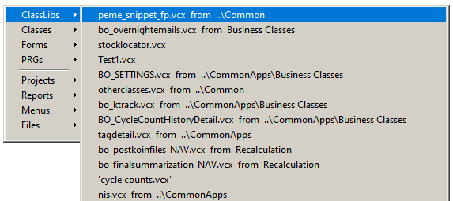

**Class Browser Enhancements** 
---

### #45, 2023-01-13

There are two recent enhancements to [Class Browser](https://github.com/VFPX/ClassBrowser).

* If Thor is active, adds classes and class libraries opened into VFP's MRU lists
* Thor tool "Install Class Browser" installs/uninstalls this new version of Class Browser.

Many Thor tools, including PEMEditor, GoFish and Go To Definitions, update VFP's native MRU lists.

To get to the MRU lists without going to the command window, use the Thor tool "MRUs", best accessed if assigned to a hot key.

---
See also [Thor News](../Thor_news.md) and the [Thor Forum](https://groups.google.com/forum/?fromgroups#!forum/FoxProThor).  
