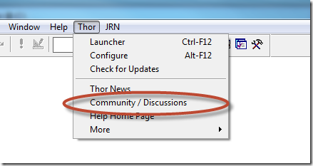
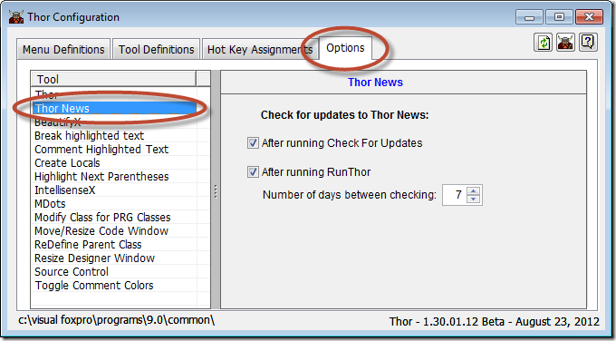

  

Tool manager for FoxPro
===
[Thor Forum](http://groups.google.com/group/FoxProThor)

[Thor Videos](Thor_videos.md)

[Thor TWEeTs](TWEeTs.md)

**New Thor Tools and [SuperBrowse](Thor_superbrowse.md) Enhancements** 
---

### #42, 2015-11-30

A number of new Thor tools are available in the Thor Repository.

*   'Toggle tabs in pageframe' – It can be quite difficult (OK, cumbersome) to navigate between pages of a pageframe when the tabs are not visible.  Use this tools to toggle the tabs in the current pageframe.
*   'Compare text in two windows' – Use your favorite compare tool to compare the code from two different code windows without exiting FoxPro, as follows:
    *   Select one text window
    *   Execute this tool (hot key is recommended)
    *   Select a second text window
    *   Execute this tool again  
            -- and the contents of the two windows will be compared

> **Required:**  Thor cannot guess your favorite compare tool, so you must modify the Plug-In so that Thor can call it. The default code for the Plug-in calls Beyond Compare (_personal note: highly recommended!)_ and must be modified to fit your environment.

*   Three new tools for [VFP2Text](http://pfsolutions-mi.com/Product/VFP2Text), a add-on from Frank Perez, Jr. for Beyond Compare, that allow direct comparison of VCXs and SCXs
    *   'Download VFP2Text for Beyond Compare V3'
    *   'Download VFP2Text for Beyond Compare V4'
    *   'VFP2Text Home Page'

There have been some enhancements to **[SuperBrowse](Thor_superbrowse.md)** as well:

*   As it can be quite cumbersome switching between Expression and Value in the filter box, you can now overwrite the current setting as follows:
    *   To select Value, use a trailing ‘$’
    *   To select Expression, use a leading ‘=’
*   "Value" filters on all selected fields or, if none, all character fields.
*   Double-clicking a row (to edit using Dynamic Forms) brings up a read-only form if the table is read-only.
*   A new setting allows leading characters from memo fields to be displayed instead of "Memo".
*   Double-clicking a memo fields brings up that field alone for editing.
*   There are a number of new plug-ins:
    *   Format field picker -- create alternative formats to those provided on the first page ("Picker") to conform to your own preferences
    *   Bind column events -- bind events in the grid columns to this class
    *   Grid context menu -- create context menus for the cells in the grid  

See also [History of all Thor TWEeTs](TWEeTs.md) and [the Thor Forum](https://groups.google.com/forum/?fromgroups#!forum/FoxProThor).

---

Previous headlines
---

**[2015-01-12 : Two New Projects added to VFPX](News_Items\Item_41.md)**

**[2014-01-04 : Go To Definition](TWEeTs\Tweet_27.md)**

**[2014-12-22 : Three New Thor Tools](TWEeTs\Tweet_26.md)**

**[#38, 2014-12-17 Two New Projects added to VFPX](#Headline38)**

**[#37, 2014-11-30 TWEeT #25: Five New Thor Tools for FoxBin2PRG](TWEeTs\Tweet_25.md)**

**[#36, 2014-11-25 TWEeT #24: Nine New Thor Tools](TWEeTs\Tweet_24.md)**

**[#35, 2014-11-17 TWEeT #23: Buffer Overrun Detected!](TWEeTs\Tweet_23.md)**

**[#34, 2014-06-11 TWEeT #22: Related IntellisenseX Tools](TWEeTs\Tweet_22.md)**

**[#33, 2014-06-04 TWEeT #21: Advanced Features: Plug-Ins for IntellisenseX](TWEeTs\Tweet_21.md)**

**[#32, 2014-05-29 TWEeT #20: Quick Start Guide to IntellisenseX](TWEeTs\Tweet_20.md)**

**[#31, 2014-05-21 TWEeT #19: Deficiencies in IntellisenseX (and how to avoid them) … The Custom Keyword List](TWEeTs\Tweet_19.md)**

**[#30, 2014-05-10 TWEeT #18: IntellisenseX for Nested Objects](TWEeTs\Tweet_18.md)**

**[#29, 2014-04-29 TWEeT #17: Using Local Aliases in IntellisenseX](TWEeTs\Tweet_17.md)**

**[#28, 2014-03-03 TWEeT #16: Custom Keyword List for Field Names](TWEeTs\Tweet_16.md)**

**[#27, 2014-02-24 TWEeT #15: IntellisenseX and the Alias Dictionary](TWEeTs\Tweet_15.md)**

**[#26, 2014-02-17 TWEeT #14: IntellisenseX for Objects](TWEeTs\Tweet_14.md)**

**[#25, 2014-02-10 TWEeT #13: New (hidden) IntellisenseX Feature](TWEeTs\Tweet_13.md)**

**[#24, 2014-02-03 TWEeT #12: IntellisenseX by Dot or by Hot Key?](TWEeTs\Tweet_12.md)**

**[#23, 2014-01-27 TWEeT #11: IntellisenseX: Aliases for VFP Tables](TWEeTs\Tweet_11.md)**

**[#22, 2014-01-20 TWEeT #10: IntellisenseX: Field Names from SQL Server Tables](TWEeTs\Tweet_10.md)**

**[#21, 2014-01-13 TWEeT #9: Extract to Variable and Extract to Constant](TWEeTs\Tweet_09.md)**

**[#20, 2014-01-05 TWEeT #8: Creating Properties and Methods (#3)](TWEeTs\Tweet_08.md)**

**[#19, 2013-12-18 TWEeT #7: Creating Properties and Methods (#2)](TWEeTs\Tweet_07.md)**

**[#18, 2013-08-26 Thor Version 1.40 released: Thor ToolBar](#Headline18)**

**[#17, 2013-06-23 New VFPX Project: Finder](#Headline17)**

**[#16, 2013-03-31 New Video: 50 Ways to Run a Thor Tool](#Headline16)**

**[#15, 2012-03-05 New Thor Tool: AutoComplete](#Headline15)**

**[#14, 2012-01-16 Thor videos available from Thor menu](#Headline14)**

**[#13, 2012-01-05 Thor's Tool Launcher: The one tool you must use](#Headline13)**

**[#12, 2012-11-16 Thor menus provide access to Discussion Forums and Change Logs](#Headline12)**

**[#11, 2012-11-10 Online FoxPro Users Group (OFUG) created](#Headline11)**

**[#10, 2012-10-14 New VFPX Project: FoxcodePlus](#Headline10)**

**[#9, 2012-10-06 Easy access to all VFPX home pages](#Headline9)**

**[#8, 2012-09-30 IntellisenseX released as a VFPX project](#Headline8)**

**[#7, 2012-09-19 All VFPX projects can be downloaded from Thor](#Headline7)**

**[#6, 2012-09-16 Use the Thor discussion group](#Headline6)**

**[#5, 2012-09-10 IntellisenseX released](#Headline5)**

**[#4, 2012-09-09 Data Explorer is now a Thor tool](#Headline4)**

**[#3, 2012-09-04 New VFPX Projects: Dynamic Forms & Data Explorer](#Headline3)**

**[#2, 2012-08-30 Join the Thor Beta discussion group](#Headline2)**

**[#1, 2012-08-25: Introducing Thor News](#Headline1)**

---

Two New Projects added to VFPX 
---

#### <a name="Headline41"> #41, 2015-01-12</a>
 

Two new projects have been added to VFPX and are available from Check For Updates.

* [ThemedTitleBar](https://github.com/VFPX/ThemedTitleBar) -- The TitleBar of a VFP form displayed ‘In Screen’ or ‘In Top-Level Form’ looks a bit outdated nowadays, at least running in Win8 and compared to Office 2013 or Visual Studio 2013. The goal of this project is to provide a modern drop-in replacement for the default TitleBar, requiring no code changes to existing forms.
* [VFP 9 SP2 Hotfix 3 Download](https://github.com/VFPX/VFP9SP2Hotfix3) is the most recent hotfix for VFP 9 SP2. The hotfix includes all three hotfixes released for VFP 9 SP2
 

See also [History of all Thor TWEeTs](TWEeTs.md) and the [Thor Forum](https://groups.google.com/forum/?fromgroups#!forum/FoxProThor).  

Two New Projects added to VFPX
---

#### <a name="Headline38">#38, 2014-12-17</a>
 

Two new projects have been added to VFPX and are available from Check For Updates.

[VFP Runtime Installers](https://github.com/VFPX/VFPRuntimeInstallers) contains the runtime installers for VFP versions 6 thru 9 (since they are no longer available from Microsoft’s website)
[StripeX](http://github.com/VFPX/StripeX) is a wrapper class for working with Stripe.com.
 

See also [History of all Thor TWEeTs](TWEeTs.md) and the [Thor Forum](https://groups.google.com/forum/?fromgroups#!forum/FoxProThor).  

---

Thor Version 1.40 released: Thor ToolBar
---

#### <a name="Headline18">#18, 2013-08-26</a>
 

Added the Thor ToolBar.  Tools may be added to the Toolbar may using the checkbox shown in the Thor Configuration form,  below (and also available in the Tool Launcher.) TBL

When you add a tool to the Thor Toolbar, you can select a caption for the tool or select an image to represent it.  In the sample below, abbreviated captions are used.

The toolbar’s size, positioning, and docking, persist from one session to the next. (Truth be told, persisting the docking has been problematic.)

---

New VFPX Project: Finder
---

#### <a name="Headline17">#17, 2013-06-23</a>
 

The new VFPX project *Finder* is a powerful search tool to find forms and classes. It searches either a project or folder (with sub-folders) for names of files or classes.

Files or classes can be opened by double-clicking and there are numerous other options available from the context menu for rows in the grid.

When Class Search is used, the classes found can be dragged/dropped onto forms or classes being edited.

See the [Finder Home Page](https://github.com/VFPX/Finder) and watch the [Finder introductory video](http://www.youtube.com/watch?v=uL4a9gsCLlk&feature=youtu.be) (11:25).

--- 

Thor videos available from Thor menu
---

#### <a name="Headline14">#14, 2013-01-16</a>
 

There are already a number of videos explaining features of Thor and there are more to come. Follow the link from the Thor menu to the list of all Thor videos.

---

Thor's Tool Launcher: The one tool you *must* use
---

#### <a name="Headline13">#13, 2013-01-05</a>
 

Thor’s Tool Launcher uses a simple screen that allows you to browse through all the Thor tools by keyword, to read their descriptions or visit their home pages, to set their options, and, most importantly, to run them. It also helps you to organize the tools that you use most to make them easily accessible.

Thor suffers from an over-abundance of tools – there are so many that it may seem impossible to find 12ich tools are of interest to you. The Tool Launcher simplifies that search.

Watch [this short video](http://youtu.be/2ttBR9vQqew) (7:57) to learn all about it.

---

Thor menus provide access to Discussion Forums and Change Logs
---

#### <a name="Headline12">#12, 2012-11-16</a>
 

The Thor menu has been changed to provide access to a number of related Discussion Forums.

These forums are the preferred form of communication about these tools, rather than private emails, or using the Universal Thread, Foxite, or any other on-line forums.

Change logs for the various tools and components of Thor are now available, as well as a link to the never ending list of Thor ERs.

---

Online FoxPro Users Group (OFUG) created
---

#### <a name="Headline11">#11, 2012-11-10</a>
 

A new Online Foxpro User Group is starting up. For more information, join the Google group at[ https://groups.google.com/forum/?fromgroups#!forum/ofug](https://groups.google.com/forum/?fromgroups#!forum/ofug).

Meetings will be held the 3rd Tuesday of each month at 8:30 Eastern Standard Time via GotoMeeting.com or equivalent.

Details about how to join the meeting will be published on the group forum (see link above) immediately before the me1ting is to start.

We intend to record the meeting and make it available on-line for those unable to attend.

Next Meeting: Tuesday, November 20th, 8:30 PM Eastern Time (0130 UTC Wednesday, November 21)

Presenters:

Matt Slay - Dynamic Forms
Jim Nelson - PEM Editor and related tools

---

New VFPX Project: FoxcodePlus
---

#### <a name="Headline10">#10, 2012-10-14</a>
 

The new VFPX project [FoxcodePlus (Beta 1)](https://github.com/VFPX/FoxcodePlus) is available from Check For Updates.

This project is ***not*** related to IntellisenseX, another VFPX project, although both provide Intellisense enhancements. FoxCodePlus provides a wider range of features and includes some of the features provided by IntellisenseX. Although not yet tested, it appears that the two may be used concurrently.

After downloading (which includes both the code and documentation), you can use the Thor menu pad in the system menu to 10en the folder in which these components are installed:

---

Easy access to all VFPX home pages
---

#### <a name="Headline9">#9, 2012-10-06</a>
 

Thor now provides ready access to the home pages for all VFPX projects, available from the Thor menu pad.

---

IntellisenseX released as a VFPX project
---

#### <a name="Headline8">#8, 2012-09-30</a>

IntellisenseX has been released as a VFPX project.

*IntellisenseX* refers to a suite of Thor Tools that provide functionality similar to native Intellisense. These tools display lists of available variable names, field names, or members (properties, events, methods, and objects) while you type code, just like Intellisense. However, they cover those areas that Intellisense forgot (such as the list of field names in a table when editing in a code window) and provide8ew capabilities, available through customization, such as displaying the list of field names in an SQL table.

Visit the [IntellisenseX home page](https://github.com/VFPX/IntelliSenseX) and also watch the [Intellisense training videos](https://github.com/VFPX/IntelliSenseX#videos). <!-- TBL video -->

IntellisenseX is available from Check For Updates. <!-- TBL -->

All VFPX projects can be downloaded from Thor
---

#### <a name="Headline7">#7, 2012-09-19</a>

The current version of all VFPX projects can now be downloaded directly from Check For Updates. <!-- TBL -->

The projects listed in Check For Updates are listed alphabetically within these five groups:71. Projects that you have already downloaded for which there is a more current version. (see #4)
1. Projects that you have not downloaded which have had updates in the last three months
1. All other projects that you have not downloaded
1. Projects that you have already downloaded and which are current
1. All projects marked as “never update”.  This takes precedence over any of the categories above.

---

Use the Thor discussion group for comments, suggestions, bug reports, etc.
---

#### <a name="Headline6">#6, 2012-09-16</a>

Use the “Community / Discussions” menu item in the Thor menu pad to send comments, suggestions, bug reports, and so on to the [Thor Discussion Group](http://groups.google.com/group/FoxProThor). You are invited to become a member of the group so that you can see what is going on in the land of Thor.

Two things of note:

* You can email discussion questions (with screenshots) directly to:

    [foxproThor@googlegroups.com](mailto:foxproThor@googlegroups.com)

*When reporting bugs, please provide as much information as possible, including screenshots. Any information you can provide (such as an image of the debugger, etc.) will be greatly appreciated.

---

IntellisenseX released
---

#### <a name="Headline5">#5, 2012-09-10</a>
*IntellisenseX* refers to a suite of Thor Tools that provide functionality similar to native Intellisense. These tools display lists of available variable names, field names, or members (properties, events, methods, and objects) while you type code, just like Intellisense. However, they cover those areas that Intellisense forgot (such as the list of field names in a table when editing in a code window) and provide new capabilities, available through customization, such as displaying the list of field names in an SQL table, as shown below. For a full description, see the [IntellisenseX Home Page.](https://github.com/VFPX/IntelliSenseX)

---

Data Explorer is now a Thor tool
---

#### <a name="Headline4">#4, 2012-09-09</a>
Data Explorer 3 is now available as a Thor Tool. This means that you can choose to access it by hot key by assigning the hot key in the Thor configuration form.

---

New VFPX Projects: Dynamic Forms & Data Explorer
---

#### <a name="Headline3">#3, 2012-09-04</a>
Two new VFPX projects have been created in the last few days and are available from Check For Updates:

* [Dynamic Forms](https://github.com/mattslay/DynamicForms)
* [Data Explorer 3](https://github.com/rschummer/DataExplorer)

After downloading, you can use the Thor menu pad in the system menu to open the folder in which these components are installed:

---

Join the Thor Beta discussion group.
---

#### <a name="Headline2">#2, 2012-08-30</a>

**The [Thor Beta discussion group](https://groups.google.com/forum/#!forum/foxprothorBeta)** is intended for discussions of features currently under development for Beta versions of Thor, the Thor Repository, and PEM Editor.

All other Thor issues should be directed to the [Thor discussion group](https://groups.google.com/forum/#!forum/foxprothor).

To use the Beta version for Thor, download [Thor Repository Beta Updater.Zip](http://vfpxrepository.com/dl/thorupdate/Tools/Thor_Repository/Beta/Thor_Update_Thor_RepositoryBeta.zip) and unzip it into this sub-folder of the folder where you have installed Thor: **Thor\Tools\Updates\My Updates**

Thereafter, you will see a record for "Thor Repository Beta" when you run "Check For Updates".

---

Introducing Thor News.
---

#### <a name="Headline1">#1, 2012-08-25</a>

This is the first installment of the Thor News, which will notify you of changes and updates to Thor. It will also, from time to time, explore some of the more interesting tools found in Thor.

The latest news will be brought to you:

*   each time that you run Check For Updates
*   once a week when you execute RunThor.

You can change these settings in the Thor Configuration form:

