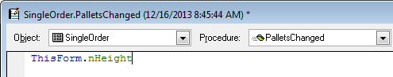

Thor TWEeT #7: Creating Properties and Methods (Part 2)
===

[Last week's TWEeT](Tweet_06.md) discussed the familiar way of creating properties and methods, a two-step process where their creation and reference are done independently.

There’s a different pattern available where you can create properties and methods at the same time that you refer to them.

To do so, create a reference in a code window to the to-be-created property or method (leaving the cursor immediately after the name)

and then call tool **Go To Definition**. This opens the form for adding new properties and methods:

When creating methods, you can also choose to create the LParameters list at the same time:

Note that there is no requirement that you call **Go To Definition** immediately.  You can come back at any time after writing the code to create the property or method.  Just click anywhere in the name (although if you want to create the LParameters list, you need to click after the right parenthesis) and then call **Go To Definition.**

A couple of comments on this:

*   I highly recommend trying this technique.  It is highly addictive. This is my tool of choice for creating properties and methods. For all the time I have spent in creating [PEM Editor](https://github.com/VFPX/PEMEditor), I *rarely* use it to create properties and methods.
*   This is only one of great features from **Go To Definition**.  There will be more on it another day, in its own TWEeT.

Form properties can also be referenced by other properties, such as ControlSource and RecordSource. If you use [PEM Editor](https://github.com/VFPX/PEMEditor) to edit the ControlSource or RecordSource properties, you will automatically be given the opportunity to create a new property when you click Save.

For all of these uses, the following features (not available from standard New Property and New Method) are available:

*   MemberData is automatically updated if the name contains any uppercase characters.
*   If you are creating a new property:
    *   There is an option to set the initial value of the property based on the first character of the property name (‘c’ = Character, ‘n’ = Numeric, etc). Default = ON
    *   You can create a [Plug-In](../Thor_add_plugins.md) to use some other method for assigning the initial values (such as using the second character)
*   If you are creating a new method:
    *   You can open it immediately for editing.
    *   You can create a [Plug-In](../Thor_add_plugins.md) that will populate the header of the newly created method. 

See also [History of all Thor TWEeTs](../TWEeTs.md) and [the Thor Forum](https://groups.google.com/forum/?fromgroups#!forum/FoxProThor).
