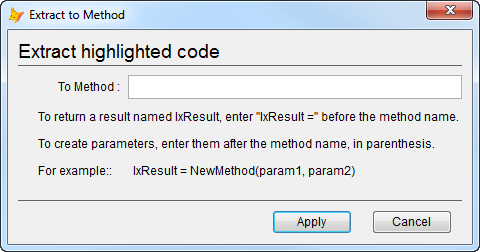

Thor TWEeT #8: Creating Properties and Methods (Part 3)
===

This is the third and last in a series of TWEeTs showcasing the various ways that you can create properties and methods.

There is one more Thor tool that creates methods: **Extract to Method**.

Use this tool when you have a block of method code (from a VCX or SCX) that you want to remove from the current code window and save into a new method.

The steps to do so are simple:

*   Highlight the lines of code you want to extract and move
*   Invoke tool **Extract to Method**.

This pops up a form where you can enter the name of the method to be created:

When you click “Apply”, the following steps are performed:

1.  The new method is created.
2.  The code window for the new method is opened
3.  The code you had highlighted in the original method is pasted into the new code window.
4.  The highlighted code is removed from the original code window.
5.  A reference to the new method is pasted into the original code window.

Note as well the comments in the form that comes up:

*   You can specify a result for your created method; the last line of the method returns that result and that result is also assigned in the original code window.
*   You can specify parameters to your created method;  an LParameters statement is inserted at the beginning of the new code window and the parameters are used in the call in the original code window.

**Extract to Method** works in code windows from VCXs and SCXs, but not PRGs.

See also [History of all Thor TWEeTs](../TWEeTs.md) and [the Thor Forum](https://groups.google.com/forum/?fromgroups#!forum/FoxProThor).