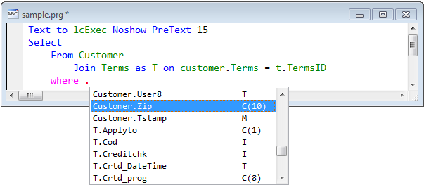

Thor TWEeT #13: New (hidden) IntellisenseX Feature
===

In a previous TWEeT ([IntellisenseX: Field Names from SQL Server Tables](Tweet_10.md)), I demonstrated how you can make some features of IntellisenseX active if you create a SELECT statement in sort of an inside-out fashion – that is, if you create your FROM and JOIN phrases first before referencing any fields. There is another feature that becomes available when you do so (one that you are unlikely to discover without being told of its existence).

Consider this simple example:

Once you have already specified the table you are selecting from, IntellisenseX provides a simple way to select from the fields in that table – just invoke IntellisenseX as you always do, by pressing the dot (or [hot key](Tweet_12.md)).

When you have specified any JOINs, the dropdown list shows all fields from all tables, as shown below (where the list has been scrolled so you can see some fields from each table).

_Note the ‘;’ that was necessary on the first line – IntellisenseX looks backward through your code to determine the entire statement you are working on, recognizing line continuations. Without that ‘;’ after SELECT, IntellisenseX would not recognize this as part of a SELECT statement at all._

If you use the “Match anywhere” option (see “IntellisenseX” on the Options page in the Thor Configuration screen), the list will filter as you begin typing a field name:

This new IntellisenseX feature

*   works for both VFP tables (as shown) and SQL Server Tables. (See  [IntellisenseX: Field Names from SQL Server Tables](Tweet_10.md))
*   works for references to field names anywhere in SELECT statements, as long as the tables have been referenced in the FROM and JOIN phrases.
*   works for table-aliases

See also [History of all Thor TWEeTs](../TWEeTs.md) and [the Thor Forum](https://groups.google.com/forum/?fromgroups#!forum/FoxProThor).
