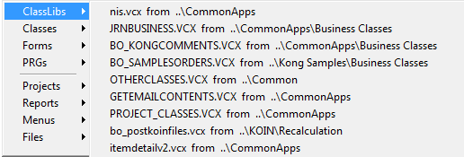

Thor TWEeT #3: Remember MRUs?
===

Remember when you used to live in the Command Window and you would use MRU lists for opening forms, files, classes, etc?  

When you began relying on other tools, like the Project Manager and Class Browser, you couldn't use MRU lists anymore, though, since these other tools did not update the MRU lists, nor were MRUs made available any way other than from the Command Window.

But now it's time to resume using MRUs since Thor tools resurrect them, maintaining them and providing new ways to access them.

First of all, all Thor tools, most notably **[GoFish](https://github.com/mattslay/GoFish), [Finder](https://github.com/VFPX/Finder)**, and **[PEM Editor](https://github.com/VFPX/PEMEditor)**, but also all other Thor tools that open files, always update the appropriate MRU list when opening a file (whether form, class, table, report, etc.). In addition, they provide two other features:

*   They maintain a new MRU list for all *class libraries* that are opened.
*   They open each file using the same case for the file name as is found on disk, so that the case of file names is not changed.

> _Note: It might seem that this would not help you if you open files from the Project Manager or Class Browser, but there are simple modifications you can make to both to achieve the same effect as all other Thor tools,  See the end of this message._

The main Thor tool for access MRU lists is called simply **MRUs**, and it displays a pop-up menu of all the different MRU lists (including, at the top, the list unique to Thor, of MRU class libraries.)

There are a number of other Thor tools that access these same MRU lists:

*   **MRU class libraries** -- provides a list of only the MRU class libraries (the first item from the menu shown above)
*   **HackCX4 from MRU forms or classes** -- creates a popup menu showing the MRU for forms and class libraries so that they can be they can be opened by HackCX4, (Requires separate installation of HackCX4 from [WhiteLightComputing](http://www.whitelightcomputing.com/prodhackcxpro.htm))
*   [Finder](https://github.com/VFPX/Finder) -- lists are available by right-clicking on either the "File Search" or "Class Search" buttons atop the screen.
*   [PEM Editor](https://github.com/VFPX/PEMEditor) -- lists are available from the "Open File" button atop the screen.

There are also two Thor tools that are slightly mis-named, as they really refer to most-recently-*changed* classes and files, based on timestamps rather than MRU lists. Note that **Finder** can also be used to find most-recently-changed classes and files

*   **MRU classes in this project** - note that this uses the internal timestamp within a VCX for when a class was last updated, rather than the timestamp of the VCX file itself.
*   **MRU files in this project**

***Updating MRU lists from the Project Manager or Class Browser***

Thor provides files you can install so that files opened from the Project Manager or Class Browser will update your MRU lists appropriately. These files are found in folder Thor\Tools\Samples.

> _Note: The MRU lists are updated only if you have run Thor. If you haven't, Project Manager and Class Browser will still work normally._

*   To change Project Manager, use the code from class BaseProjectHook of BaseProjectHooks.VCX
    *   If you are not using ProjectHooks, modify the project to use this class (I recommend copying the class library to some other folder)
    *   If you are already using ProjectHooks, simply copy the code from the only method in the class into your project hook file.
*   To change Class Browser, copy the file Browser.APP into the home folder for FoxPro -- Home(1)

See also [History of all Thor TWEeTs](../TWEeTs.md) and [the Thor Forum](https://groups.google.com/forum/?fromgroups#!forum/FoxProThor).

