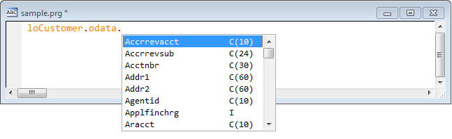

Thor TWEeT #15:  The Alias Dictionary
===

There have been some improvements in the handling of table aliases since the earlier TWEet on [IntellisenseX: Aliases for VFP Tables](Tweet_11.md).

The difficulty in what was described there is that the solutions do not go far enough.  The first example shows that <a href="https://github.com/VFPX/IntelliSenseX" target="_blank">IntellisenseX</a> recognizes aliases create by USE statements:

But this alias is only recognized by IntellisenseX within the same procedure as the USE statement. If this table were opened in the LOAD event of a form, the alias would be available there – and in no other methods.

And the #Alias directive has the same limitation – to be of value, it must be inserted into every single method referencing the table.

The solution offered by the _Alias Dictionary_ is that there is a table (maintained by Thor) that contains **global**> definitions of tables (or objects – but we will get to that later on).

You can add records to this table by executing Thor tool **Browse Table/Object Alias List**, which does exactly that – it opens a browse window where you can add records (or edit existing records), like this:

Henceforward, whenever you enter “SomeAlias” and invoke IntellisenseX as you always do, by pressing the dot (or [hot key](Tweet_12.md)), it will open table “PartsListFields”.

>Note well: This is truly a *global* definition for “SomeAlias”. It is not relative to the current form, class, folder, project, or application, or anything else.

For the table name you can enter also enter full path or relative paths.

As noted earlier, you can also add entries to this table that correspond to global objects. To do this, you can enter “=” followed by an executable expression in the Table field.

There are a few points of interest worth noting:

*   NewObject() is used in this example, instead of CreateObject(), because NewObject() accepts a third parameter of zero so that the INIT method does not fire.
*   If CreateObject() would in fact return the correct object, you can supply an empty (‘’) second parameter to NewObject().

There are two alternatives that can be used instead of calling NewObject():

*   You can copy a LOCAL statement and paste it directly into the table.
*   You can enclose the class name and class library name in curly braces, such as **{ClassName,ClassLib.VCX}.** The class library name is optional if CreateObject() would in fact return the correct object.

Actually, *any* executable expression (preceded by '”=”) will work, as long as the result is one of these:

*   an object
*   the alias of an open table
*   the alias of a table that Thor can open
*   an object containing an array named ‘aList’. This array may have up to three columns and the contents of the array will populate the drop down list.

#### Nested Objects in the Alias Field

The alias field may also contain references to nested objects.  Consider, for instance, the sample below, where oData is actually understood to be populated (at run time) by a Scatter from the Jobs table.

This is achieved by the entry shown below.

All of the discussion above describing the various combinations that can be used in the Table field apply equally well when using a nested object in the alias field.  Below we have the the definition of “oApp.oAdmin” so that it will present the list of properties from the Admin object defined in the Table field. (Note that any of the values in the Table field for “dataAdmin”, “dataAdmin2”, or “dataAdmin3” would have worked just as well.)

#### Wildcards in the Alias Field

You can also use a single “*” as a wildcard in the Alias field.

This allows you to see the PEMs for the this particular object any time that it is referenced, regardless of the parent object that owns it.

Finally, the characters that the wildcard represents can be used in the Table field; simply use <*> (as shown below)

Thus, in this example, “*” replaces the text “PartsList”, so the fields from the PartsList table are displayed.

And similarly for the Customer table ….

If you happen to name your objects consistently, you can pass the extracted text as a parameter to your own UDF, which should return the object as a result. (Note the necessary use of quote marks around <*>.)

The following shows how ‘PartsList’ is passed as a parameter to my UDF “MyLookerUpper”, which returns the object for ‘PartsList’ as a result. As noted before, UDF “MyLookerUpper” should call NewObject() with a third parameter of zero so that its INIT does not execute.

See also [History of all Thor TWEeTs](../TWEeTs.md) and [the Thor Forum](https://groups.google.com/forum/?fromgroups#!forum/FoxProThor).
