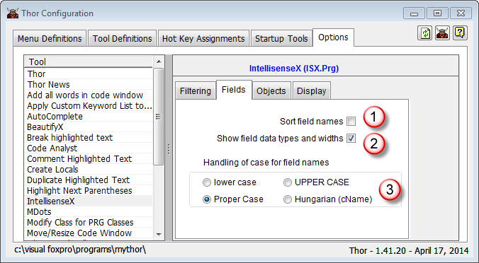
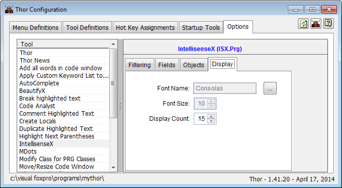

Thor TWEeT #20: Quick Start Guide to [IntellisenseX](https://github.com/VFPX/IntelliSenseX)
===

When I began writing TWEeTs about [IntellisenseX](https://github.com/VFPX/IntelliSenseX) (back in **January!**), I could never have guessed that the topic would not be exhausted by now. But writing those TWEeTs engendered discussions and new ideas, so that much of what was described in the most recent TWEeTs was not even imagined back then.

In re-reading those TWEeTS, one glaring omission jumped out at me – they explain how IntellisenseX works and how you can customize it, but they never touched on the first step – how to get started in the first place.  So here we go.

#### Getting started with [IntellisenseX](https://github.com/VFPX/IntelliSenseX)

There are only a few steps to getting IntellisenseX up and running to provide a number of extensions to native FoxPro Intellisense.  Once set up, you will find that using the dot (whether after object references or table references) produces the helpful dropdown list in a lot of different places that instantly feel natural. There are also some further customizations you can make, most quite minor, that allow IntellisenseX to provide its assistance in a number of quite surprising ways.

To get started, open Tool Launcher, enter “IntellisenseX” in the filter box, and then click on the tool “IntellisenseX – by Dot” in the TreeView on the left.

Check off “Run at startup”. This will cause IntellisenseX to be enabled each time you start Thor in your IDE.  (The tool “IntellisenseX – by Dot” is actually a toggle, enabling/disabling IntellisenseX; however the occasions where it was desirable to have it disabled have been eradicated, so it can be turned on and left on.)

Then, click on the Options link to open the  IntellisenseX options page in the Thor Configuration form.

On the first page of the IntellisenseX pageframe (“**Filtering**”), select the three options indicated below.  The first two combine to form one of the sweet enhancements of IntellisenseX – the dropdown list is filtered as you type to show only matching entries and the matches can be anywhere in the each row, not just to the leading characters.

The second page (“**Fields**”), controls how field names are displayed in drop down lists. I suggest setting the first two options as shown here and setting the third (“case for field names”) according to your own style. There is further customization available, to be addressed later.

The third page (“**Objects**”) determines when IntellisenseX displays the drop down lists for objects in a visual class (THISFORM or THIS) or PRG-based class.  Originally, you will want to use the default FoxPro Intellisense for SCXs and VCXs.  Without some additional configuration, IntellisenseX is simply too ponderously slow for objects in SCXs and VCXs.  However, once you have created your Custom Keyword List (see TWEeTs  [#19: Deficiencies in IntellisenseX (and how to avoid them) … The Custom Keyword List](Tweet_19.md)), you will want to select the second option (IntellisenseX).

The fourth and last page (“**Display**”) controls the display of the dropdown list used in IntellinsenseX. Be careful not to set the Display Count too large as you can get undesirable behavior if the dropdown list can’t fit either above or below the current screen position.  This setting should not matter too much, however, as you become familiar with IntellisenseX, since the filtering (set on the first page) will rapidly reduce your list to only a few entries.

Having set these few options, you have enough to begin using IntellisenseX.  There are a number of features immediately available for you to take advantage of, described in earlier TWEeTs:

*   IntellisenseX recognizes aliases for VFP tables created a number of different ways.  See [#11 IntellisenseX: Aliases for VFP Tables](Tweet_11.md).
*   A unique IntellisenseX feature provides a drop-down list for all fields in all tables referenced in FROM and JOIN statements in SQL statements. See  [#13 New (hidden) IntellisenseX Feature](Tweet_13.md).
*   IntellisenseX recognizes objects referenced in code in a variety of formats and provides dropdown lists for them (including the familiar native LOCAL … AS … command).  See [#14 IntellisenseX for Objects](Tweet_14.md).

In addition, a number of other significant enhancements are available after some further configuration.

*   Creating the “Custom Keyword List” eliminates the problem in referencing objects in VCXs and SCXs (noted earlier in the description of the “**Objects**” page) and creates a uniform list of words used throughout your applications (overriding the select of field names described above in the “**Fields**” page). See TWEeTs  [#19: Deficiencies in IntellisenseX (and how to avoid them) … The Custom Keyword List](Tweet_19.md) and [#16 Cuord Listom Keywst for Field Names](Tweet_16.md).
*   You can obtain the list of field names from your SQL Server tables when creating SQL statements (including those within TEXT/ENDTEXT blocks).  See [#10 IntellisenseX: Field names from SQL Server Tables](Tweet_10.md).
*   You can create local aliases for table or object names that apply throughout a specific procedure (these have the same scope as local variables).  See [#17: Using Local Aliases in IntellisenseX](Tweet_17.md) .  (See also note below.)
*   You can create global aliases for table or object names that apply throughout all  your applications, using the _Alias Dictionary_ (a free table)   See [#15 The Alias Dictionary](Tweet_15.md).  (See also note below.)
*   You can create aliases that apply within a form or class, creating dropdown lists for nested objects, such as “This.oBusObj” and “This.oBusObj.oData”and “This.oBusObj.oJobs.oData”.  See [#18: IntellisenseX for Nested Objects](Tweet_18.md).  (See also note below.)

_Note:_ IntellisenseX treats tables (whether VFP tables or SQL Server tables) merely as a special type of object, one where each member has a data type and (possibly) width.  Thus, in all cases where you read “object” in any of the references above, understand that the object could be an actual VFP object or the fields referenced in a table. The references to “oData” in the last bullet point above can actually be references to the field names related to a business object.

See also [History of all Thor TWEeTs](../TWEeTs.md) and [the Thor Forum](https://groups.google.com/forum/?fromgroups#!forum/FoxProThor).
