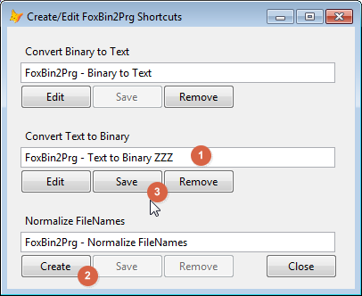

Thor TWEeT #25: Five New Thor Tools for FoxBin2PRG
===

There are five new tools in the Thor Repository for working with FoxBin2PRG.

Four of these tools provide different ways for converting the binary files (“X” files) in a project to their corresponding text files or going the other direction, from the text files to the binary files:

*   _[Convert all binary files to text files](#T1)_
*   _[Convert files with changed internal timestamps](#T2)_
*   _[Convert most recently changed binary files](#T3)_
*   _[Generate binary files from all text files](#T4)_

Each of these tools are project-related, as they use the active project, if there is one, or else prompt for the name of the project to work on.

The other tool creates “SendTo” shortcuts in Explorer so that you can convert to/from text files while working in Explorer.

*   _[Create/Edit FoxBin2Prg "SendTo" shortcuts](#T5)_

All of these tools assume that you have downloaded and installed FoxBin2PRG.  This works automatically if you have used Thor’s Check For Updates to download it, as they know exactly where to look for it. Otherwise, you can modify the [Plug-In](../Thor_add_plugins.md) “Get FoxBin2PRG Folder” to point to the folder where you have installed FoxBin2PRG.


Thanks to Mike Potjer, who wrote three of these tools, which inspired the creation of the other two which are based on the file and internal timestamps.

### <a name="T1"></a>Convert all binary files to text files

The tool _Convert all binary files to text files_ converts a VFP .PJX file, and all the binary files in the project, to their FoxBin2Prg text format.  This conversion is done through the FoxBin2Prg.EXE, so all your FoxBin2Prg configuration settings will be respected.

For large projects, this may take a while, so there is a progress bar to demonstrate that it is awake.

You can run this tool programmatically as well.

```foxpro
ExecScript(_Screen.cThorDispatcher, ‘Thor_Tool_Repository_FoxBin2PrgConvertProjectToText’)
```

### <a name="T2"></a>Convert files with changed internal timestamps

The tool _Convert files with changed internal timestamps_ converts all binary files where the internal timestamps in the rows of the binary file have changed. These timestamps are changed when you use any of the designers (Form, Class, Report, and so on) or when you make replacements using GoFish, so the effect is that the conversion is only performed for the small number of files you have changed since the last time this tool was run.

This effect is achieved by setting the timestamp on the each text file to match the most recent timestamp on any of the rows in the corresponding binary file.

This tool can be dramatically faster than _Convert all binary files to text files_ for those projects where most files are not being changed. (For example, it takes about 40 seconds to run _Convert all binary files to text files_ for my largest project, only 2 or 3 seconds to run this tool when I have only changed a handful of files.)

Note, however, if you hack a file, whether by HackCX or manually, the text file may not be automatically created, as the internal timestamps in the rows of the binary file will not have changed.  There are a number of ways you can correct for this

*   Use tool _Convert most recently changed binary files_ (below).
*   Open the binary file in its Designer, make a slight modification to it, and save it.
*   Erase the text file manually.

You can run this tool programmatically as well.

```foxpro
ExecScript(_Screen.cThorDispatcher, ‘Thor_Tool_Repository_OptimizedFoxBin2PrgConvertProjectToText’)
```

### <a name="T3"></a>Convert most recently changed binary files

The tool _Convert most recently changed binary files_ converts the most recently changed external timestamp (such as you see in Explorer).   You can indicate the definition of “most recently changed” to be based either on the number files to change or the number of days since they have changed:


This tool was originally created as a solution to the problem noted above where text files might not be re-created for binary files that have been hacked, but there is no particular reason that this is its only usage.

You can run this tool programmatically as well.

```foxpro
ExecScript(_Screen.cThorDispatcher, ‘Thor_Tool_Repository_ConvertMostRecentToText’)
```

### <a name="T4"></a>Generate binary files from all text files

The tool _Generate binary files from all text files_ works in the other direction, creating binary files from the text files. 

This tool currently assumes you are using the PJ2 extension for your project text file, but this easy enough to change via a constant in the tool code.  Perhaps in the future the tool can be enhanced to get the extension from an option setting or by reading FoxBin2Prg configuration settings.  All other extensions are handled according to the FoxBin2Prg configuration settings. 

There are limitations with this tool due to the way VFP leaves VCX files in memory, and thus it will try to execute `Clear All`, which is only possible when called from a menu or via hotkey.  The tool will still run from the Tool Launcher or the Thor toolbar, but you will get a warning, and under certain conditions FoxBin2Prg might give you an error message and not regenerate your .VCX files.

You can run this tool programmatically as well.

```foxpro
ExecScript(_Screen.cThorDispatcher, ‘Thor_Tool_Repository_FoxBin2PrgConvertTextToProject’)
```

### <a name="T5"></a>Create/Edit FoxBin2Prg "SendTo" shortcuts

The tool _Create/Edit FoxBin2Prg "SendTo" shortcuts_ displays a dialog that makes it easy to setup or remove Windows "Send to" shortcuts for the VB scripts included with FoxBin2Prg.  If you already manually created shortcuts in the standard user "Send to" folder, this tool should find them and allow you to edit them.



1.  A default name for the shortcut is displayed in a textbox, allowing you to edit the name directly in this form.  TAB out of the textbox when you finish editing the name, then either
2.  Click the Create button to add the shortcut, if it doesn't already exist, or
3.  Click the Save button to update the name if the shortcut already exists.


After clicking the Create button,

1.  The caption will change to Edit, allowing you to edit any other settings of the shortcut, and
2.  The shortcut will now appear under the "Send to" context menu in Windows Explorer.

The Edit button opens the Windows file properties dialog, where you can edit any settings of the shortcut.


The Remove button simply deletes the shortcut, moving it to the recycle bin.  There is a non-visual class in the Thor_Tool_FoxBin2PrgCreateShortcuts.PRG which performs all the real work of this tool, so if you want to create your own version of the tool with a different interface, or no interface at all, it should be pretty easy to do.  There is some code commented out in the .PRG which demonstrates creating all the shortcuts programmatically.

See also [History of all Thor TWEeTs](../TWEeTs.md) and [the Thor Forum](https://groups.google.com/forum/?fromgroups#%21forum/FoxProThor).
