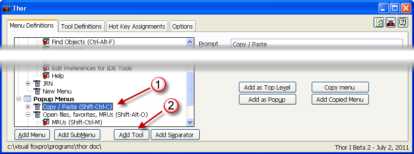

Adding tools to menus
===

To add a tool to any of the various kinds of menus:

1. Click on the menu to which you want to add the tool.
2. Click on 'Add Tool'

Then, drop-down the combobox to see the TreeView of all tools (organized by Source, Category, and sub-Category)

You can then change the prompt for the tool, if desired, and the status bar text.