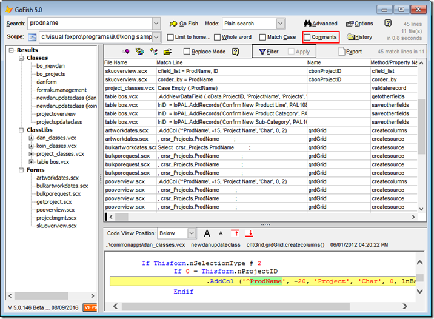

Installing tools published on VFPx
===

There are a number of tools that can be downloaded directly from VFPx:

### The Thor Repository

Inherent in the design of Thor is the anticipation that members of the FoxPro community will have utilities of value that can well be shared throughout the community. The structure of the tool PRGs make such sharing simple.

The 'Thor Repository' is a catalog of such tools.  The intent is that this repository grow over time, as developers submit tools to be included.  The starting repository has about a dozen such tools.

To register the tools from the Repository, copy the PRGs from the ZIP file into the folder **Thor\Tools**

[Click here for the Thor Repository](Thor_repository.md) 

### Tools from PEM Editor

Version 7 of PEM Editor, now re-named 'PEM Editor w/ IDE Tools', contains more than three dozen tools that can be accessed through Thor.  These include some tools released in version 6 of PEM Editor, along with a large number of completely new tools.  These can be downloaded from the PEM Editor page.

PEM Editor also "publishes" a pair of objects that simplify building further tools.  More than half of the original tools in the Thor Repository use these objects.

Registration of the tools from PEM Editor occurs automatically (if Thor is running) when you install PEM Editor by executing:

    Do PEMEditor.APP
[Click here for PEM Editor 7 with IDE Tools](https://github.com/VFPX/PEMEditor)

### GoFish5

GoFish 5 is an advanced code search tool for fast searching of Visual FoxPro source code.  It can be integrated with Thor if Thor has been run in the current IDE session, as seen below:

[Click here for GoFish 5](https://github.com/mattslay/GoFish)
