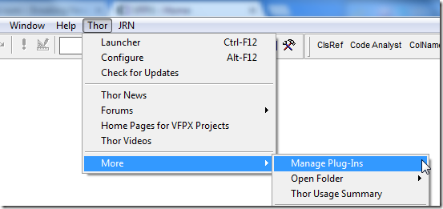
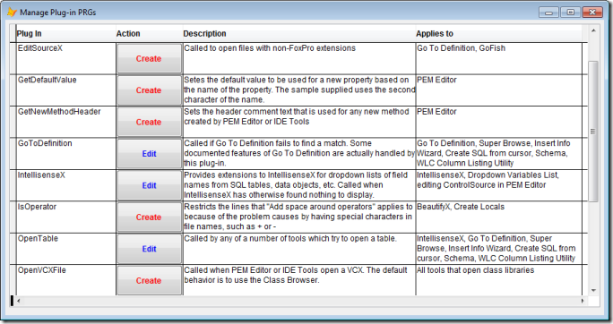
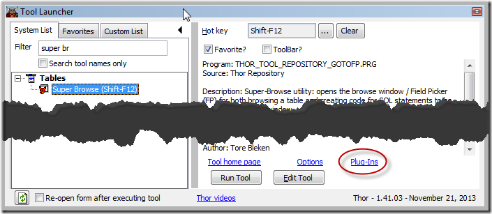

Plug-in PRGs
===

Thor provides a large number of Plug-in PRGS that allow you to customize the behavior of various Thor tools.  These plug-ins can either replace existing behavior or add new behavior.

You can access the list of all Plug-Ins from the Thor menu:

This opens a form from which you can create or modify existing plug-ins:

When you click Create for one of these Plug-Ins, a sample PRG will be opened for you, with comments describing parameters, results, etc.

If you save it (Ctrl+S or Ctrl+W), it will be saved into your “My Tools” folder from which it will be accessed thereafter by Thor tools. The PRG name will also be saved in your [MRU list for PRGs](https://groups.google.com/forum/?fromgroups#!topic/FoxProThor/_hyu9XVSQ3A), so you can edit the Plug-In thereafter from the command line. (Note that the name of the PRG is not necessarily the same as the name that appears in the table).

You may find it more convenient to show only the Plug-Ins that apply to a particular Thor tool.  Starting from either the Tool Launcher or Thor Configuration form, select the tool and then click on the Plug-Ins link at the bottom right of the form, as show below.  The form shown above opens but shows only those Plug-Ins that apply to this tool.  Note that this link only appears if there are any Plug-Ins for the tool.

The available plug-in PRGs are:

**Plug-in** |**Description**
---|---
AfterComponentInstall|Called during "Check For Updates" after a component is installed (in a sub-folder of Thor\Tools\Components).  Allows you to re-install the component in the folder where you normally use it within your APPs
AutoRenameControl|Sets the new name for a control when auto-renaming. The "normal" new name is supplied as a parameter so it can be used in those cases where it is acceptable.
BeforeComponentInstall|Companion to AfterComponentInstall
BuildProject|Provides the Build Project dialog used in Finder.
CloseControlStructure|Sets the text that is pasted in as the closing line of code in control structures (IF/ENDIF, TRY/CATCH, and the like), which may include text from the opening line of code and which may depend on how many lines of code there are.
[CreateLocalsStatements](#CreateLocalsStatements)|Creates the LOCAL statements as part of "Create Locals"; allows you to determine the order and format of LOCAL statements as well as which variables are to appear in the LOCAL statement.
EditSourceX|Called to open files with non-FoxPro extensions
FormatFieldPicker|Creates the "Field Picker" string for fields that have been selected in [SuperBrowse](Thor_superbrowse.md).
GetDefaultValue|Sets the default value to be used for a new property created by PEM Editor based on the name of the property. The sample supplied uses the second character of the name.
GetNewMethodHeader|Sets the header comment text that is used for any new method created by PEM Editor or IDE Tools
GoToDefinition|Called if Go To Definition fails to find a match. Some documented features of Go To Definition are actually handled by this plug-in.
[IntellisenseX](#IntellisenseX)|Provides extensions to IntellisenseX for dropdown lists of field names from SQL tables, data objects, etc. Called when IntellisenseX has otherwise found nothing to display.
IsOperator|Restricts the lines that "Add space around operators" applies to because of the problem causes by having special characters in file names, such as + or -
[OpenTable](#OpenTable)|Called by any of a number of tools which try to open a table.
OpenVCXFile|Called when PEM Editor or IDE Tools open a VCX. The default behavior is to use the Class Browser.
SetGridHighLighting|Sets the highlighting (coloring) for the rows in the PEM Editor grid
SetGridSortOrder|Sets the index expression used for sorting the rows in the PEM Editor grid
SortAutoComplete|Allows for modification of the drop down list from AutoComplete
Spell Field Names|Determines the spelling of field names from tables. Note that options already provided are [lower \| UPPER \| Mixed \| Hungarian (cName)]

### <a name="CreateLocalsStatements">**CreateLocalsStatements**</a>

This plug-in is called after either of the Thor tools that create LOCALs, “Create Locals” and “BeautifyX”, have compiled a list of all the variables assigned in a procedure.
 
The parameter is a ten column array, as described in the comments.
 
The result is to be a character string, with embedded CRs as desired, that is to be the text of the new LOCAL statements.
 
The sample provided is the exact code that is used within Thor. You can thus tailor the content and display of the LOCAL statements to fit your needs.

### <a name="IntellisenseX">**IntellisenseX**</a>

When you press the dot to initiate IntellisenseX, it goes through a number of paces to determine the meaning of the text preceding the dot (is it an alias? is it an object? and so on).
 
If all possibilities fail, the last recourse is to call this plug-in that allows you to interpret the text before the dot. The parameter passed to the plug-in is an object containing a number of different properties, as described in the comments. There a number of different results that can be returned to generate the IntellisenseX drop-down list.
 
There is much that can be done with this PRG, including (but not limited to) these two capabilities demonstrated in the sample PRG:
 
1.  **SQL server table** - If you use SQL server tables, you could use SQLColumns() to get the list of fields from a table. The sample PRG uses a different approach, reading the table definition from  a dictionary in a free table.
2.  **Data Object** – If you have forms or classes that have data objects and you can readily extract the alias for the underlying table from these forms or classes, you can have the fields from the table appear in the IntellisenseX dropdown. There are probably an infinite number of ways that this could be implemented, and the sample demonstrates three of them:
    *   If the parameter passed in is “This.oData” (such as from wwBusiness) and the class has a property “cAlias”, then it is used as the alias for the underlying table.
    *   If the parameter passed in is “Thisform.oBusObj.oData” (such as from wwBusiness) and the class/form has a property “cAlias”, then it is used as the alias for the underlying table.
    *   If the class name is “bo_” + {SomeName}, then {SomeName} is used as the alias for the underlying table.

### <a name="OpenTable">**OpenTable**</a>

A number of Thor tools, including IntellisenseX and Super Browse, work on open tables, identified by a table alias. If there is an open table (or view) matching that alias, all is well and processing commences. If not, however, they call the OpenTable plug-in in an attempt to open the table matching the alias.

The default processing for OpenTable is to try each of the following, in turn, in attempt to open the table:

1.  Try to USE the file (opening a table from the current folder or path)
2.  Check the MRU list for DBFs
3.  If there is an open form, look for the file in the DataEnvironment

If this is not sufficient to open a table (for instance, if your file names do not match their aliases, or are not found in a folder in your path), modify OpenTable to suit your environment:
 
*   The parameter is the alias that is being searched for.
*   The result is the alias that was opened (and need not be the same as the parameter!), or empty if not found.

You can also use this Plug-In to access SQL Server tables, for which there are a couple of uses:
*   To provide the list of field names for IntellisenseX
*   To provide the data structure visible in Super Browse, allowing creation of SELECT and other SQL statements on the “Picker” page

The default PRG opened for you when you create OpenTable has examples of how to achieve this.