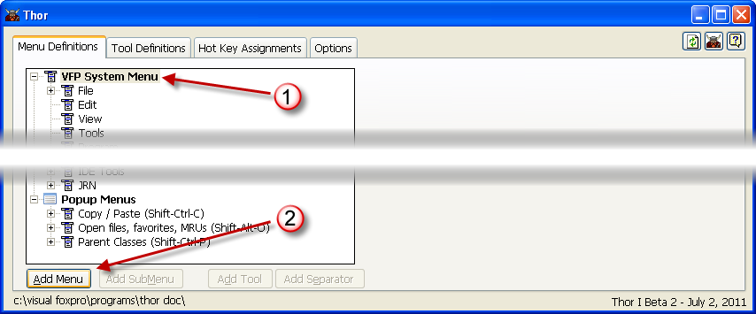
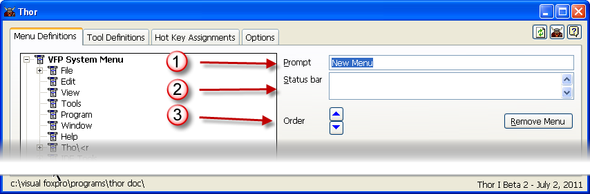

Creating New Menu Pads
===
To create a new pad in the VFP system menu bar:
* Click on the **VFP System Menu** node at the top of the TreeView
* Click on the Add Menu commandbutton

You can now:

* Assign the prompt for the new menu
* Assign the text that will appear in the status bar
9 Move the new menu up to where you want it to be displayed.  See [Moving menu pads](Thor_moving_menu_pads.md).

You can also take an existing menu (either a pop-up menu or a sub-menu) and add it to the VFP system menu bar.  See [Duplicating menus](Thor_duplicating_menus.md).