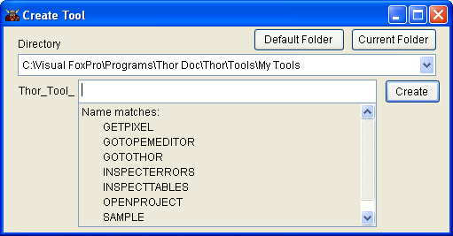

Creating New Tools
===

To create a new tool, use the 'Create Tool' button on the second page (**Tool Definitions**) of the Thor form. 

 

This will bring up the 'Create Tool' form, which guides you in selecting the folder and file name for the new tool. 

Thor look for files named **Thor_Tool_*.PRG** in the following folders:
  
1.  CurDir()  
1. All folders in your path
1. **Thor\Tools\MyTools** -- the recommended folder for personal tools
1. **Thor\Tools** -- the recommended folder for downloaded tools, such as from PEM Editor 7 with IDE Tools or the Thor Repository 
 
<!--- TBL: Previous: Links to PEME and Thor repository, wrong in old source --->
  
Obviously, there can be name conflicts, as there could be PRGs with the same name in different folders. Thor resolves these conflicts by recognizing the first such tool encountered, ignoring any following tools with the same name. 

This design provides a substantial benefit, as it turns out. If the folder (**Thor\Tools**) is only used for downloaded tools, there is never any danger that your personal tools will conflict with them. Beyond that, you can select any of the downloaded tools, particularly any of those from the Thor Repository, make adjustments to them to suit your taste, and save them in **Thor\Tools\MyTools**. These personal copies will always take precedence, then, over any downloaded copies. 

The 'Create Tools' form gives you a combobox showing all the folders that Thor will search (in the order they will be searched), as well as a textbox where you can enter the name of the tool you will be creating. The listbox underneath shows the names of all tools already in that folder whose names might be in conflict with the name you are creating. 

This will create the PRG and open it for you to edit. 

As you can see below, the "header" of the new PRG is a group of about 40 lines which act as a questionnaire, allowing the tool to tell Thor about itself. 

 

The actual code for the tool is to be placed in the Procedure ‘**ToolCode**’, at the very end of the listing.

As always, it is advantageous to browse other tools (something you can also do from within the Thor form), to see examples of how these properties are normally used. 

A final suggestion: assign the same value for .**Source** for all of your personal tools, so that the Thor form will group them together. 

### See also:

* [Browsing the list of tools](Thor_browsing_tools.md)  
* [Assigning hot keys to tools](Thor_assign_tool_hot_keys.md)
* [Editing existing tools](Thor_editing_existing_tools.md) 
* [Tools to make tools](Thor_tools_making_tools.md)
