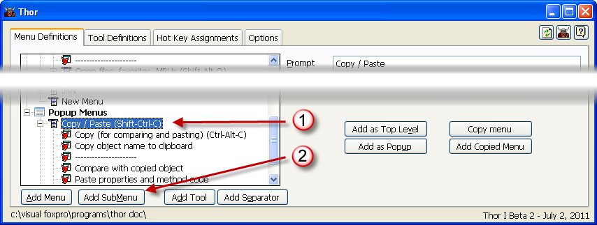

Creating sub-menus
===

To add a new sub-menu to any VFP system menu pad (including VFP's default menu pads), popup menu, or sub-menu:

* Click on the menu to which you want to add the sub-menu
* Click on 'Add Sub-Menu'

