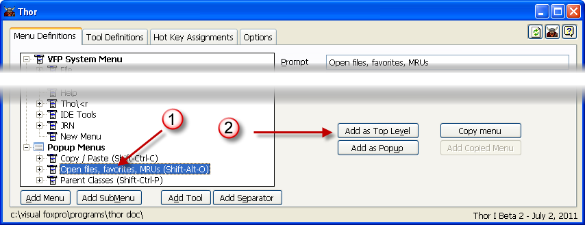
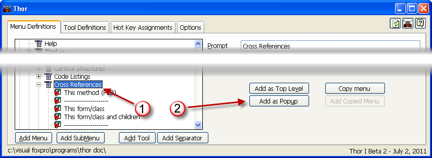
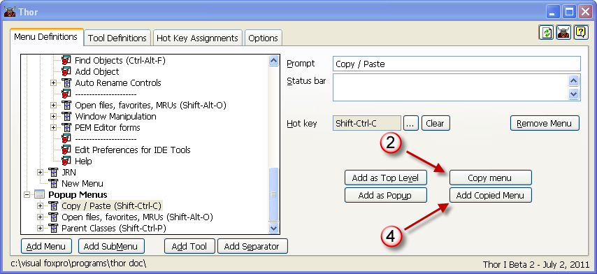

Duplicating menus
===

There are three different types of menus (VFP system menu pads, pop-up menus), and any menu you create can be used multiple times, as one or more of these three types.

Just to be clear, this means that the ***same*** menu can appear in multiple places.  Internally, it will be the same menu, and any change made to it in one place will be replicated in all the other places as well.

### To make a popup menu or sub-menu into a menu pad on the VFP system menu bar
1. Click on the menu (in the example below, a popup menu is chosen; it works the same for any sub-menu.)
1. Click on 'Add as Top Level'

### To make a VFP system menu or sub-menu into a Popup Menu
1. Click on the menu
1. Click on 'Add as Popup'

### To make ***any*** menu into a sub-meu
1. Click on the menu you want to make into a sub-menu
1. Click on 'Copy Menu'
1. Click on the menu that you want to add the sub-menu
1. Click on 'Add Copied Menu'

