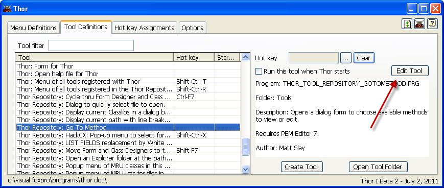

Editing Existing Tools
===

You can edit existing tools by using the second page (**Tool Definitions**) of the Thor form.

You can open a tool for editing either by double-clicking its row in the grid, or by selecting the row and then clicking the 'Edit Tool' button.

Note that changes made to the 'header' of the tool's PRG are not automatically reflected in the form's display;  see [General Usage Notes](Thor_form_usage_notes.md)

**See also**
* [Browsing the list of tools](Thor_browsing_tools.md)
* [Assigning hot keys to tools](Thor_assign_tool_hot_keys.md)
* [Creating new tools](Thor_creating_new_tools.md)
* [Tools to make tools](Thor_tools_making_tools.md)
