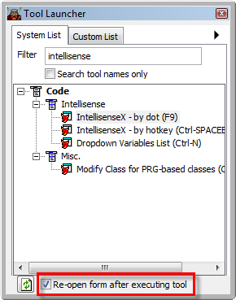
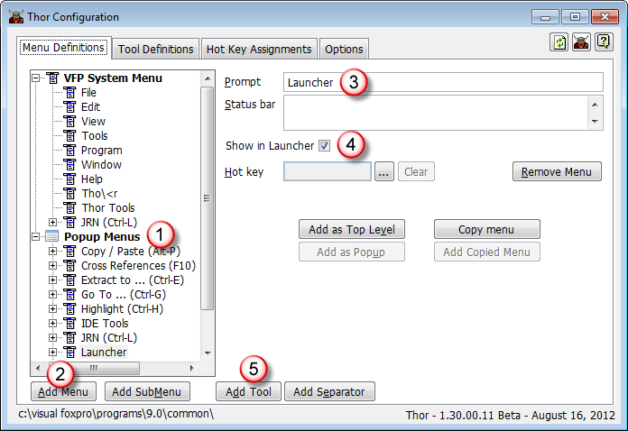

Tool Launcher
===

Tool Launcher is a Thor tool to make it easy to find and run tools. It can also be configured to save a list of your favorite Thor tools for easy access.

Tool Launcher can be started from the Thor menu, as shown below, by hot key, or each time you run Thor (if you have room for it to be always open).

The layout for the Launcher form is very similar to the second page (“Tool Definitions”) of the Thor Configuration form.

The TreeView on the left shows all the Thor tools, and when you click on a tool the controls on the right display the tool’s description, a link to the tool’s home page (if any), and buttons to assign the tool’s hot key or edit the tool.

There is also a button, highlighted in red, that will run the tool. The form will disappear when you run a tool so that the focus can return to the last window visited, as a number of tools operate on the current window.

The tool can also be run by double-clicking the tool name in the TreeView.

The list of Thor tools is now long enough that browsing it one tool at a time is quite tedious. The filter box, in red below, can be used to find tools matching the text entered. The matching is done against the tool name, description, category, and author. One way to learn about the variety of tools offered by Thor would be to use the filter with familiar FoxPro terms, such as “class”, “form”, “object”, etc.

_Note: Filtering is done using a simple $ search. A contribution providing a more sophisticated mechanism, perhaps allowing AND or OR capabilities, would be appreciated._

As the list of tools become more familiar, the need for the controls on the right diminishes. The right arrow, shown in the green circle above, can be used shrink the form by hiding these controls.

In this configuration, tools can be launched with a simple click.

If you have enough screen space, you many want to have the form visible all the time. To so do, use the checkbox highlighted in red below.

You can also create your own custom list of tools to be available from the launcher, as shown in the image below. (*Nobody* uses all of the tools.)

The author of Thor, Jim Nelson, uses hot keys for the tools he uses all the time, pop-up menus for related groups of tools (Ctrl+E for “Extract” tools, Ctrl+G for “Go To” tools, etc), and his least frequently used tools he saves in the Custom List in the tool launcher.

Use the Thor configuration form to save tools into the Custom List by following these steps:

1.  Click on “Popup Menus”
2.  Click on “Add Menu”. This creates a menu that can be used either as a popup menu (if you assign a hot key to it), in the Launcher, or both.
3.  Enter the name of your menu. This will appear as the top node in the Launcher.
4.  Click “Show in Launcher”.
5.  For each tool to be added, click “Add Tool”. (You can also click “Add SubMenu” to organize your tools into sub-menus, as shown in the image above.)

