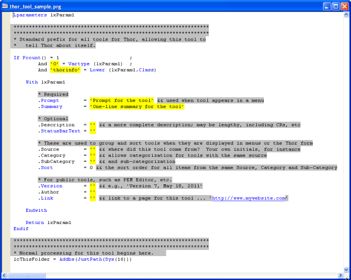

Overview of Thor
===

Thor is a tool for managing add-on tools in the IDE.  

It provides four different methods for accessing these tools:

1.  By assigning hot keys to them
2.  By creating pop-up menus accessible via hot keys
3.  By adding the tools as bars under any of the VFP system pads (File, Edit, View, etc.)
4.  By creating new pads in the VFP system menu and adding the tools as bars under these new pads

There are four parts to Thor:

1.  The catalog of tools managed by Thor. These are actually PRGs (see below).
2.  The underlying free tables, which contain the definitions of the menus hot key assignments, etc.
3.  The Thor form, accessible by either hot key or from a menu pad on the VFP system menu, which manages all the menu and hot key definitions stored in the tables. (Note that this form does not have Save or Cancel buttons; changes made to it are posted immediately.)
4.  An APP which takes the definitions from the tables and updates the VFP system menu (if appropriate), creates the pop-up menus, and assigns the hot keys to the pop-up menus and/or individual tools. Since these definitions survive a CLEAR ALL, this need only be run once at the beginning of an IDE session.

#### **What are "Tools"?**

Tools are PRGs that follow a particular structure so that Thor can recognize them.  

The "header" of each tool is a group of about 40 lines which act as a questionnaire, allowing the tool to tell Thor about itself. When creating a new tool when using the Thor form, it starts out looking like this:  

The actual code for the tool follows this header. As always, it is advantageous to browse other tools (something you can also do within the Thor form), to see examples of how these properties are normally used.  

The process for creating a new tool (when using the Thor form) will guide the creation of the tool into a folder that Thor recognizes, which can be either the special sub-folder of the 'Thor' folder or any folder in the path. The default folder for new tools is **Thor\Tools\My Tools**  

One suggestion is to assign the same value for  the **.Source** property for all of your personal tools, so that the Thor form will group them together.

#### **The Thor Repository**

Inherent in the design of Thor is the anticipation that members of the FoxPro community will have utilities of value that can well be shared throughout the community. The structure of the tool PRGs make such sharing simple.  

The 'Thor Repository' is a catalog of such tools. The intent is that this repository grow over time, as developers submit tools to be included. The starting repository has about a dozen such tools.  

See the section below on One-Click Updates for downloading updates of the Thor Repository.  

### [Click here for the home page for the Thor Repository](Thor_repository.md)

#### **Tools from PEM Editor**

Version 7 of PEM Editor, now re-named 'PEM Editor w/ IDE Tools', contains more than three dozen tools that can be accessed through Thor. These include some tools released in version 6 of PEM Editor, along with a large number of completely new tools. These can be downloaded from the PEM Editor page.  

PEM Editor also "publishes" a pair of objects that simplify building further tools. More than half of the original tools in the Thor Repository use these objects.  

See the section below on One-Click Updates for downloading updates of the PEM Editor 7 with IDE Tools.

### [Click here for the home page for PEM Editor 7 with IDE Tools](https://github.com/VFPX/PEMEditor) 

#### **One-Click Updates**   
Beginning with Thor Version 1.1 (Released Oct. 23, 2011), updates to Thor, the Thor Repository, PEM Editor 7 with IDE Tools, and other tools, are all available through a single menu on the Thor menu (in the FoxPro system menu).  This new item, ‘Check for Updates’, checks to see if there are updates available for any of these tools; if any are found, they are automatically downloaded and installed.

Beginning with Thor Version 1.10.019 (Released Nov. 17, 2011), One-Click Updates may be performed automatically when starting your first IDE session of the day.  See [Running Thor](Thor_running.md).

#### **Documentation**

There is complete on-line documentation for Thor, the Thor Setup form, and other features of Thor.  [Click here](Thor_help.md)

#### **Community Forum for Thor**

Please visit the community forum for Thor at [**http://groups.google.com/group/FoxProThor**](http://groups.google.com/group/FoxProThor) to make suggestions or comments, to report problems, and to see how others are using Thor and its related tools.

#### **A Note on Hot Keys**

Thor provides for a new capability not previously available -- the ability to assign hot keys which use two or three of the Shift, Ctrl, and Alt keys, such as {Ctrl + Alt + A}. (Actually, using all three requires quite some dexterity.)  

Keyboard macros (using FKY files) are the only VFP feature which recognize usage of two or three of these keys, but macros do not cause program execution, they only place characters into the keyboard buffer.