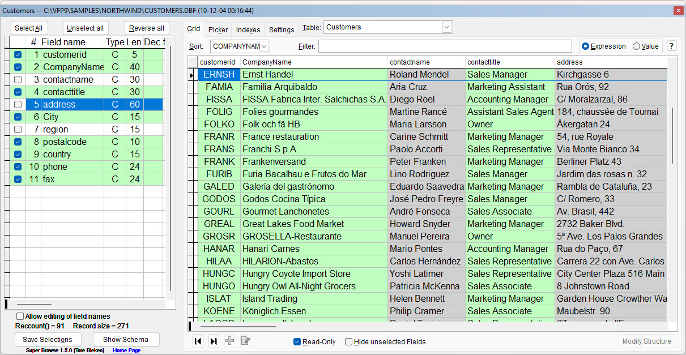
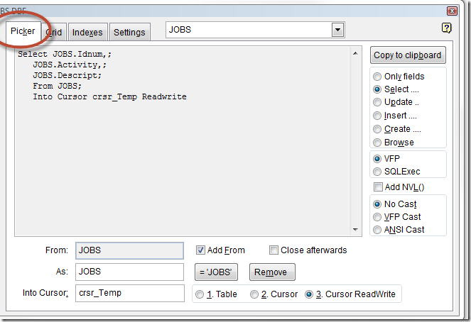
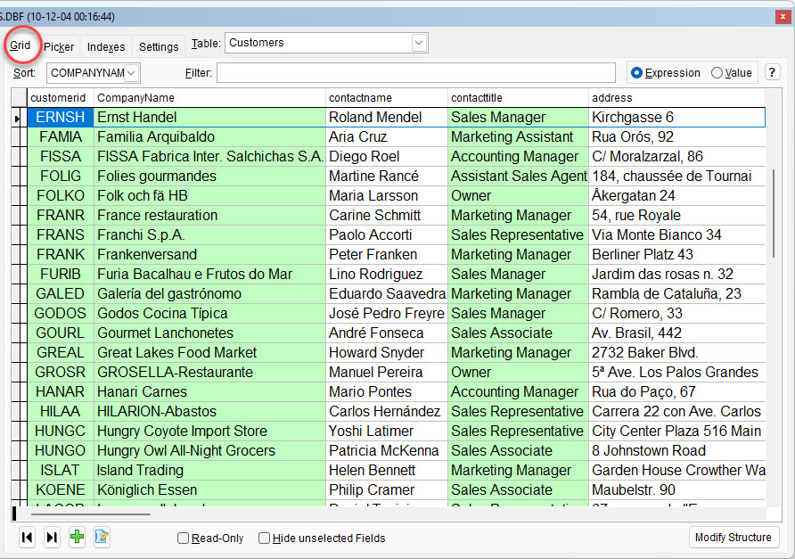

SuperBrowse
===

### Left Pane

The left pane shows a grid with the data structure of the table. The fields are listed in alphabetical order. The order can be changed by clicking one of the headers.

Click on the fields listed in the grid to mark those you wish to "process".

Click a column header to change the field order.

Below the grid are two buttons:

**Button** |**Description**
---|---
Save Selections|Saves the current selections so that the next time you open this table the same fields will be selected.
Show Schema|Opens a detailed description about the table in your browser.

### Picker Page

This page is a SQL and Browse syntax builder.

**Button** |**Description**
---|---
Only fields|Creates a list of the selected fields
Select ...|Creates a SQL Select statement
Update ...|Creates a SQL Update statement
Insert ...|Creates a SQL Insert statement
Create ...|Create a SQL Create statement
Browse|Create a Browse command

#### Option group to select SQL syntax type:

**Button** |**Description**
---|---
VFP|Creates VFP SQL syntax
SQLExec|Creates MsSQL syntax

#### Checkbox for NVL():

**Button** |**Description**
---|---
Add NVL()|Adds NVL() syntax where appropriate

#### Option group to select Cast type:

**Button** |**Description**
---|---
No|Does not add Cast()
VFP|Adds VFP type Cast()
ANSI|Creates ANSI type Cast()

#### Other options and controls:

**Control** |**Description**
---|---
“From:” Textbox|Shows the current table name
“Add From” Checkbox|Adds “From” phrase to the Select statement
“Close afterwards” Checkbox|Closes the table when SuperBrowse exits
“As:” Textbox|Fills in the Table_Alias
“=TableName” Button|Fills in the current table name in the As textbox
“Remove” Button|Blanks the As field
“Into Table” Textbox|Fill in the name of the target table/cursor
Option 1\. Table|Target is a table
Option 2\. Cursor|Target is a read only cursor
Option 3\. Cursor read/Write|Target is a read/write cursor

### Grid page:

This page is an advanced grid.

Click a column header to sort the table. 

Double-click any record to open it for editing, or viewing if "Read-Only" is checked, in a separate window created by Dynamic Forms. 

#### Filtering the grid:

**Control** |**Description**
---|---
Textbox Search Values|Enter what you want to search for
Option Expression|Searches for the expression you type in. 
Option Value|Enter what you want to search for

#### Searching in the table

The search options are best described by some samples:  

**Option type** |**Entered value**|**Description**
|---|---|---|
Expression|Name='Jim' or name = 'Tore'|Self explanatory
Expression|Obsolete|Finds every record where logical field Obsolete is .T.
Expression|Inlist(custno,10,20,30)|Self explanatory
Expression|'nit'$country|Finds every record where 'nit' is inside the field Country
Value|usa|Finds every record where the word 'usa' is inside **any** of the selected fields
Value|usa canada|Finds every record where the word 'usa' **or** 'canada' is inside **any** of the selected fields
Value|samsung & 5110|Finds every record where the words 'samsung' **and** '5110' are inside **any** of the selected fields. The **&** implies a logical AND.
Value|jim & nelson & kong|Finds every record where the words 'jim' and 'nelson' and 'kong' are inside **any** of the selected fields
Expression|\*jim & nelson & kong|Same as above, the asterisk (*) forces a Value type search **any** of the selected fields
Value|=price>100|Find all records with price > 100, the equal sign (=) forces an Expression type search **any** of the selected fields

***Note that the case is irrelevant.***

#### Easy access to the right search type

*   Begin the search text with an equal sign (=) to force an Expression type search
*   Likewise, an asterisk (*) to force a Value type search

#### For Value search, the following rules apply:

*   Each word are separated, and **any** of the words must exist in the record (**or** logic)
*   Exception: if the words are separated by an ampersand (&), **all** the words must exist (**and** logic)
*   Only selected fields are searched
*   All searches are case insensitive
*   Memo fields are also searched
*   Numeric values are searched for inside both character and numeric fields

#### Other controls on this page:

**Control** |**Description**
---|---
Listbox Sort|To select the current sort order
Button \|<|Go to previous record
Button \|>|Go to next record
Button +|Add a new record
Button Edit|Edit the current record on a separate form
Checkbox Read-Only|Self explanatory
Checkbox Hide unselected fields|Makes the grid only show selected fields
Button Modify Structure|Gives you the possibility to modify the structure. If the table is opened shared, you are asked whether you want to reopen it exclusive or not.

### Index page

Lists all active index tags, and shows the syntax to recreate the index file. Can be copied to the clipboard by marking the text with the mouse and press Ctrl-C.

### Settings page

This page should be self explanatory.  
Tip: The ForeColor and BackColor is a good tool to find the RGB values for a color. Select any color, press OK and you will see the value.  
NB! It's usually best to use ForeColor, since the default is Black.

### Keyboard shortcuts while the left grid is active:

#### Common:

**Button** |**Description**
---|---
Escape|Close the form
Enter|Close the form
Spacebar|Toggle Select Field
A|Press button Select all
B|Copy the current SQL statement to the clipboard
G|Activate page Grid
H|Toggle checkbox Hide unselected Fields (Grid page)
K|Activate page Picker
O|Copy the current SQL statement to the clipboard
R|Press button Reverse all
S|Toggle Select Field
U|Press button Unselect all

#### When Picker page is visible, these keys also are activated:

**Button** |**Description**
---|---
\:|Set focus to the textbox Into Cursor
C|Select option SQL Create...
D|Set focus to the textbox Into Local Alias
E|Select option SQL Select...
F|Toggle checkbox Add From
I|Select option SQL Insert...
L|Toggle checkbox Add NVL()
M|Click button Remove
N|Select option ANSI Cast
P|Select option SQL Update...
T|Select option No Cast
V|Select option VFP Cast
W|Select option Browse
X|Sets Local Alias to current alias
Y|Select option Only fields
1|Select option Into Table
2|Select option Into Cursor

<!--
### Keyboard shortcuts while the main (right) grid is active:

#### **NB!** These shortcuts are only active in Read-Only mode!

**Button** |**Description**
---|---
Enter|Select left grid
F|Set focus to the Searc Values textbox
K|Select left grid
-->
