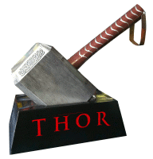

 Tool manager for FoxPro

Version 1.40 Released 2013-08-26 (tb)

[What's new in this release](#WhatsNew)

_Requires VFP9_

_**Thor** is a tool for managing add-on tools in the IDE, managing menus and hot key assignments for IDE Tools._

[**What's new in this release**](#WhatsNew)

[**Get the latest Thor news**](Docs/Thor%20News.html)

**Download App:** [Download the latest build here](http://vfpxrepository.com/dl/thorupdate/thor/Thor.zip)

**Getting Started:** **[Click here for installation instructions](Docs/Thor%20Install.html)**

**Help:** **[Click here for complete online documentation](Docs/Thor%20Help.html)**

**Discussions:** [Post questions, bug reports, discussions in the Thor Discussion Group](http://groups.google.com/group/FoxProThor)

**Tools for Thor: [PEM Editor w/IDE Tools](http://vfpx.codeplex.com/wikipage?title=PEM%20Editor%20IDE%20Tools%20Help),  ** [The Thor Repository](Docs/Thor%20Repository.html),   [GoFish4](https://github.com/mattslay/GoFish)  

Thor:

*   has a user interface to control the assignment of hot keys to tools and developer-defined menus. The UI provides four different methods for accessing these tools:
    1.  By assigning hot keys to them
    2.  By creating pop-up menus accessible via hot keys
    3.  By adding them as bars under any of the VFP system pads (File, Edit, View, etc.)
    4.  By creating new pads in the VFP system menu and adding them as bars under these new pads
*   provides a unified method for registering tools.
*   simplifies the task of sharing them between developers.

Thor comes with a ready-made list of tools from two sources, the Thor Repository and PEM Editor. (See below)

Unlike the normal limited set of hot keys available from ON KEY LABEL, Thor provides for the full range of multiple-keystroke combinations ({Ctrl + Alt + A}, for instance). 

The 'tools' managed by Thor are simply PRGs with the following characteristics

*   The PRGs are named **Thor_Tool_*.PRG**
*   The PRG must be saved anywhere in the path, or in one of two Tools folders (which are created at installation) -- one for downloaded tools, one for personal tools.
*   The first 40 lines or so of the PRG must follow a fixed template, allowing Thor to query them as to their name, description, etc.

### Documentation

**[Click here for complete online documentation of Thor](Docs/Thor%20Help.html)**

### Getting Started

**[Click here to download the latest release of Thor](http://vfpxrepository.com/dl/thorupdate/thor/Thor.zip)**.

**[Click here for installation instructions](Docs/Thor%20Install.html)**.

### Community Forum for Thor

Please visit the [Community Forum for Thor](http://groups.google.com/group/FoxProThor) to ask questions, make suggestions, report problems, and submit enhancement requests.  This is the best place to visit for all Thor-related topics.

### The Thor Repository

Inherent in the design of Thor is the anticipation that members of the FoxPro community will have utilities of value that can well be shared throughout the community. The structure of the tool PRGs make such sharing simple.  

The 'Thor Repository' is a catalog of such tools. The intent is that this repository grow over time, as developers submit tools to be included. The starting repository has about a dozen such tools. Click here for the help page for  [**The Thor Repository**](Docs/Thor%20Repository.html)  

Downloading and installation of the Thor Repository occurs automatically as part of the [One-Click Update for Thor](Docs/Thor%20One-Cick%20Update.html)

### IDE Tools from PEM Editor

Version 7 of PEM Editor, now re-named 'PEM Editor w/ IDE Tools', contains more than three dozen tools that can be accessed through Thor. These include some tools released in version 6 of PEM Editor, along with a large number of completely new tools. These can be downloaded from the PEM Editor page. Click here for the help page for [Help page for PEM Editor w/IDE Tools](Docs/PEM%20Editor%20IDE%20Tools%20Help.html)  

PEM Editor also "publishes" a pair of objects that simplify building further tools. More than half of the original tools in the Thor Repository use these objects.  

Downloading and installation of PEM Editor 7 with IDE Tools occurs automatically as part of the [One-Click Update for Thor](Docs/Thor%20One-Cick%20Update.html).

### Sample

Two new menu pads in VFP system menu (Thor and personal menu JRN) and the menu options in the Thor menu.

<a name="WhatsNew">**What's New**</a>

Thor 1.40 – Released 2013-08-26

Added the Thor ToolBar.  Tools may be added to the Toolbar may using the checkbox shown in the Thor Configuration form,  below (and also available in the [Tool Launcher](http://vfpx.codeplex.com/wikipage?title=Tool%20Launcher).)

When you add a tool to the Thor Toolbar, you can select a caption for the tool or select an image to represent it.  In the sample below, abbreviated captions are used.

The toolbar’s size, positioning, and docking, persist from one session to the next. (Truth be told, persisting the docking has been problematic.)

Thor 1.30 – Released 2012-08-19

*   Added [Tool Launcher](http://vfpx.codeplex.com/wikipage?title=Tool%20Launcher), available from the Thor menu in the VFP system menu

*   Added [Thor IntellisenseX](http://vfpx.codeplex.com/wikipage?title=Thor%20IntellisenseX).

Thor 1.1 - Released 2011-10-23  

Thor Production Release - Released 2011-09-03  

Thor I Beta 6 - Released 2011-08-22 (88 downloads)

*   a few minor bug fixes

Thor I Beta 5 - Released 2011-08-09 (91 downloads)

*   Miscellaneous minor adjustments and a couple of bug fixes

Thor I Beta 4 - Released 2011-07-17 (125 downloads)

*   Re-installation now occurs automatically. Simply using the new version of Thor.App will cause re-installation.
*   Includes full online documentation.

Thor I Beta 3 - Released 2011-07-06 (94 downloads)  

Thor I Beta 2 - Released 2011-07-04 (61 downloads)  

Thor I Beta - Released 2011-06-03 (237 downloads)

## Acknowledgments

*   The concept for this project started with Jim Nelson (the Project Manager).
*   The design was created by a group which included Doug Hennig, Eric Selje, and Tore Bleken.
*   The entire UI was designed and implemented by Doug Hennig.
